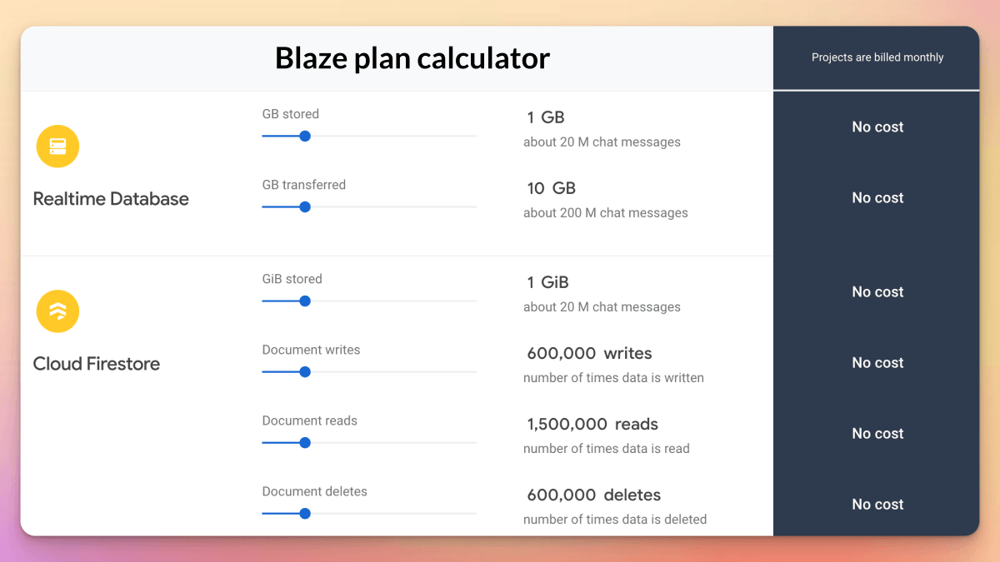
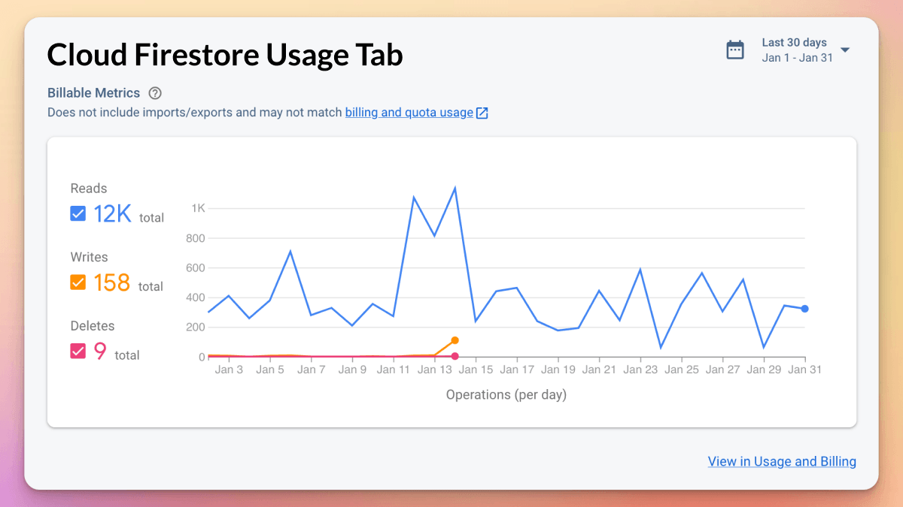
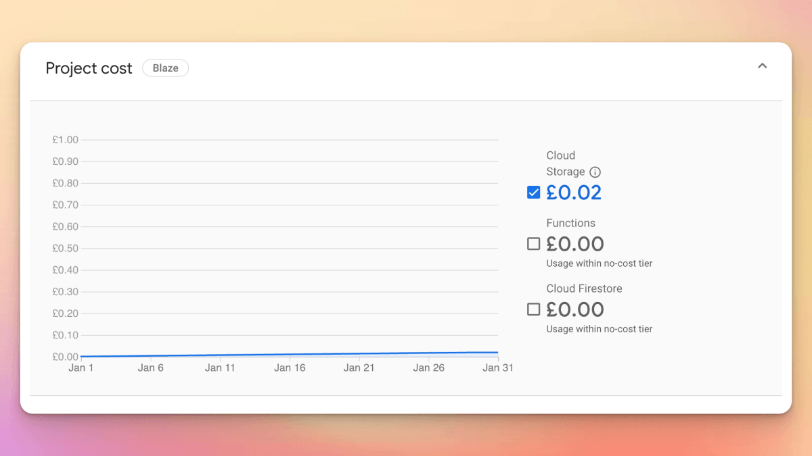
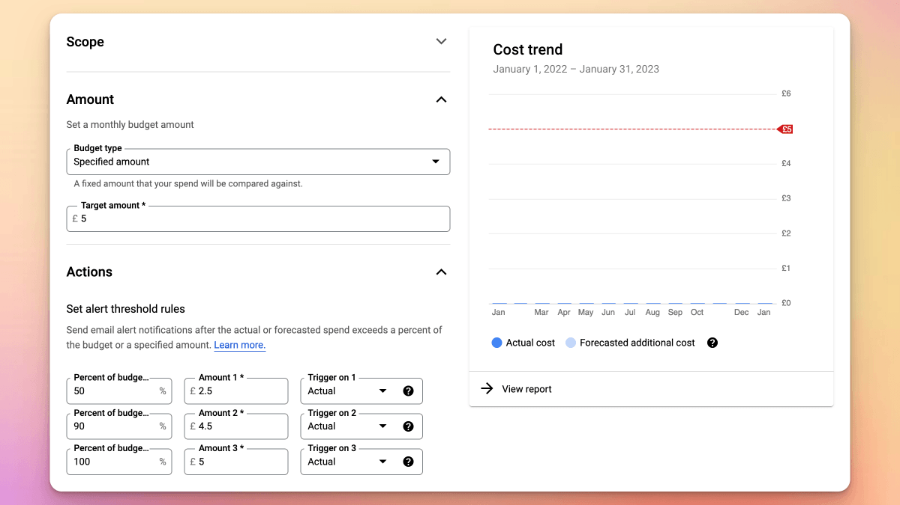

# Firebase Billing and Cost Calculator

Did you know that Firebase offers a pricing calculator that you can use to estimate your monthly costs?

The free tier is so generous that you'd have to get past 1.5M Cloud Firestore *monthly* reads before being charged a penny. 😌

But how can you check your actual usage?

🧵

---

Most Firebase products (Authentication, Cloud Firestore etc.) include a "Usage" tab where you can see a breakdown of your billable metrics. 👇

---

And if you go to "Usage and Billing", you can see your total project cost.

I couldn't take a screenshot with a good-looking chart here, since nearly all my projects cost ZERO. 😅

---

For extra peace of mind, you can go to your Google Cloud account to set a monthly budget amount.

And you can also receive email alerts when the forecasted spend exceeds a certain percent or amount.

---

Bottom line: don't be scared about your Firebase bill. 🤝

Unless you do something catastrophic, you'll be fine. 🙌

Just be careful to avoid recursive document writes in your Cloud Function triggers. 😱

And even then, budget limits and alerts should help you out. ⚠️

> **Note**: budget alerts help you be notified of excessive usage in your Firebase projects, but they don't prevent over-billing. So it's still up to you to take action and disable your project (partially or completely).

---

If you wanna learn Firebase, you can check out this course:

- [Flutter & Firebase Masterclass](https://codewithandrea.com/courses/flutter-firebase-masterclass/)

---

### Found this useful? Show some love and share the [original tweet](https://twitter.com/biz84/status/1620753669183479813) 🙏

---

| Previous | Next |
| -------- | ---- |
| [Got linter issues? Use `dart fix --apply`](../0091-dart-fix-apply/index.md) | [Add a part file with Riverpod Snippets](../0093-riverpod-part/index.md) |

