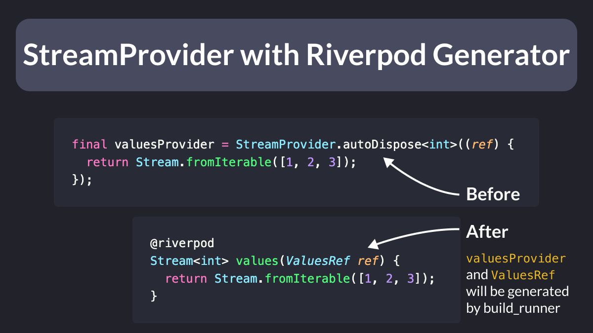

# StreamProvider with Riverpod Generator

🎉 Streams are now supported in Riverpod Generator 2.0.0! Here's how to get started:

- Declare a method that returns a Stream
- Annotate it with `@riverpod`
- Run build_runner to generate all the providers

But there's more. 🧵

---

With the Riverpod Lint package, we can convert any provider from a functional to a class variant, and vice-versa. 🎉

This means we can do things like this: 👇

---

If you want to learn more about the Riverpod Generator package, check my (updated) article:

- [How to Auto-Generate your Providers with Flutter Riverpod Generator](https://codewithandrea.com/articles/flutter-riverpod-generator/)

---

### Found this useful? Show some love and share the [original tweet](https://twitter.com/biz84/status/1633438421422055424) 🙏

---

| Previous | Next |
| -------- | ---- |
| [Fix missing `ProviderScope` error with Riverpod Lint](../0094-add-provider-scope/index.md) | [Cloud Firestore - Cache Size](../0096-cloud-firestore-cache-size/index.md) |

