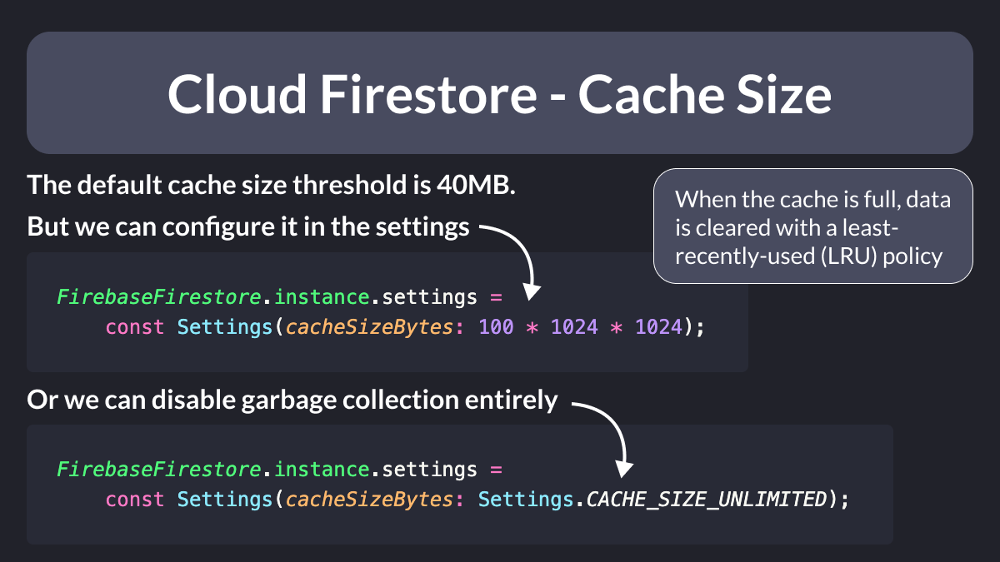

# Cloud Firestore - Cache Size

Did you know that Cloud Firestore caches every document received from the backend?

This is great for offline mode! 🔥

For more fine-grained control, you can:

- set the max cache size (default is 40MB)
- disable garbage collection entirely

Here's how. 👇

---

### Found this useful? Show some love and share the [original tweet](https://twitter.com/biz84/status/1633800807492534272) 🙏

---

| Previous | Next |
| -------- | ---- |
| [StreamProvider with Riverpod Generator](../0095-stream-provider-generator/index.md) | [Riverpod Notifier with build arguments](../0097-riverpod-notifier-build-argument/index.md) |

