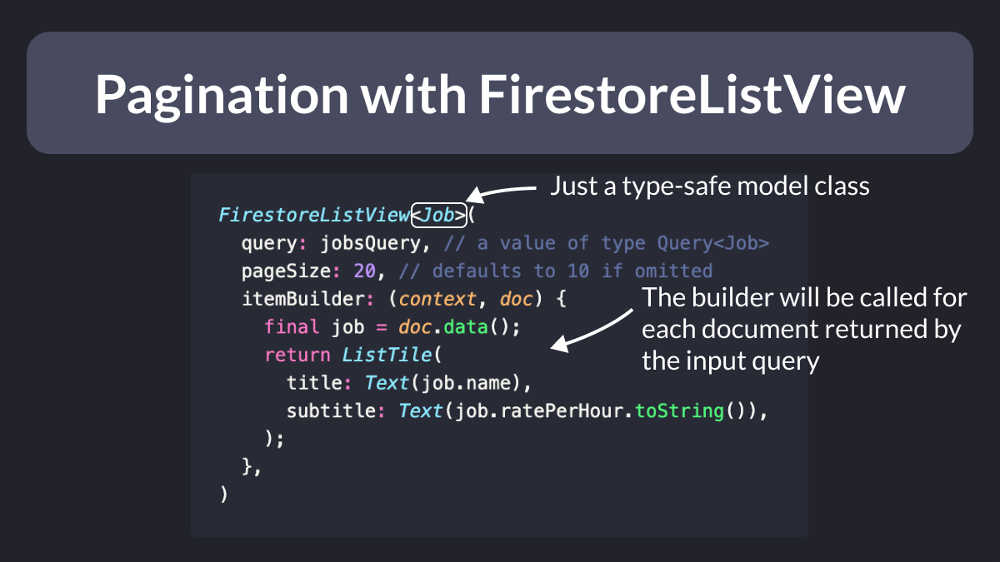
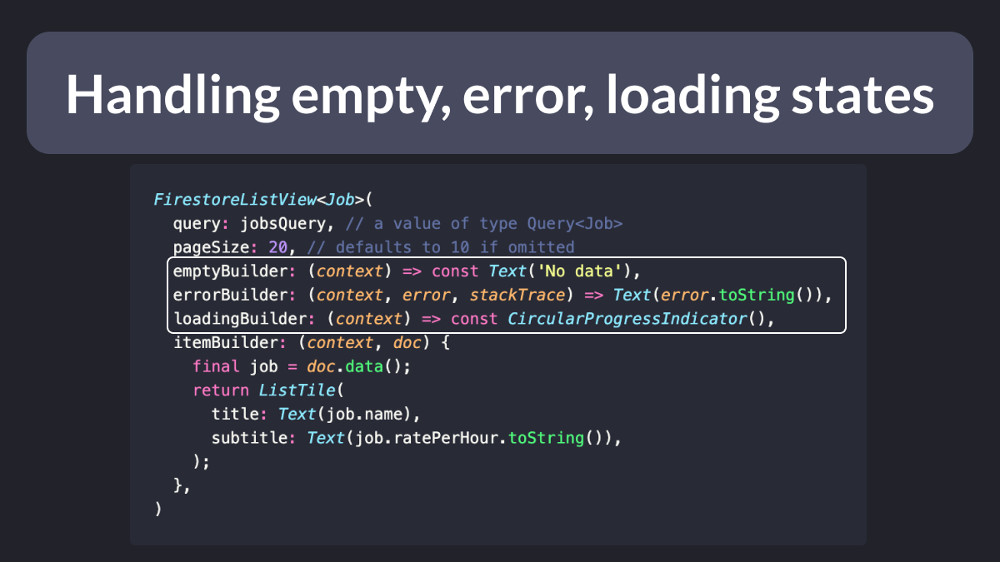

# Pagination with FirestoreListView

Ever wanted to support pagination when loading a collection of documents from Firestore?

The "firebase_ui_firestore" package makes it super-easy!

Just add it to your project and use the FirestoreListView widget whenever you need pagination.

It's that simple! 🚀

---

And if you need more control, you can specify additional arguments:

- emptyBuilder
- errorBuilder
- loadingBuilder

And you know what's cool?

If the data changes on the backend, the UI will automatically rebuild. 🚀

---

Tomorrow, I'll publish a new article about FirestoreListView and its big brother FirestoreQueryBuilder.

If you don't wanna miss it, sign up here: 👇

- [Grow as a Flutter Developer](https://codewithandrea.com/newsletter/new/)

---

But there's more!

Next month, I'll launch a brand new course about Flutter & Firebase! 🔥

And I'll offer a 40% discount when the course opens for pre-sale.

For all the details, check the course page. 👇

- [Flutter & Firebase Masterclass](https://codewithandrea.com/courses/flutter-firebase-masterclass/)

---

### Found this useful? Show some love and share the [original tweet](https://twitter.com/biz84/status/1633800807492534272) 🙏

---

| Previous | Next |
| -------- | ---- |
| [Riverpod Notifier with build arguments](../0097-riverpod-notifier-build-argument/index.md) | [Firestore OR queries 🔥](../0099-firestore-or-query/index.md) |
