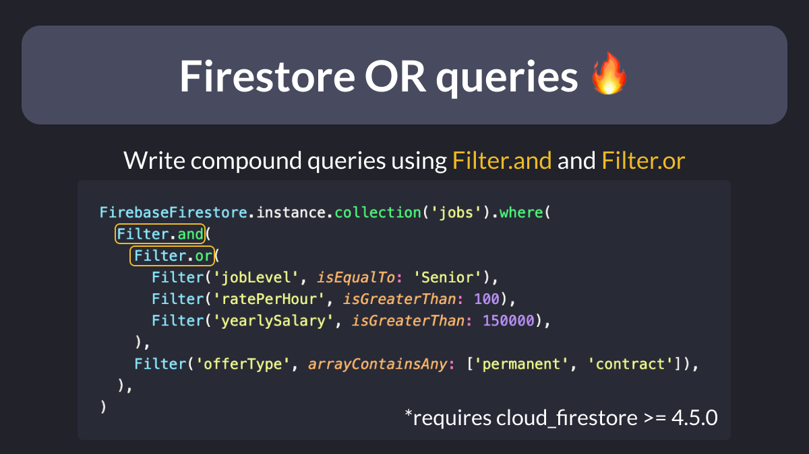

# Firestore OR queries 🔥

Are you looking for a way to write complex queries in Cloud Firestore? 🤔

Since version 4.5.0, you can use the new `Filter` object to do just that! 🔍

This lets you write conditions using OR & AND operators. 💡

---

### Found this useful? Show some love and share the [original tweet](https://twitter.com/biz84/status/1650493598465421315) 🙏

---

| Previous | Next |
| -------- | ---- |
| [Pagination with FirestoreListView](../0098-firestore-list-view/index.md) |  |
