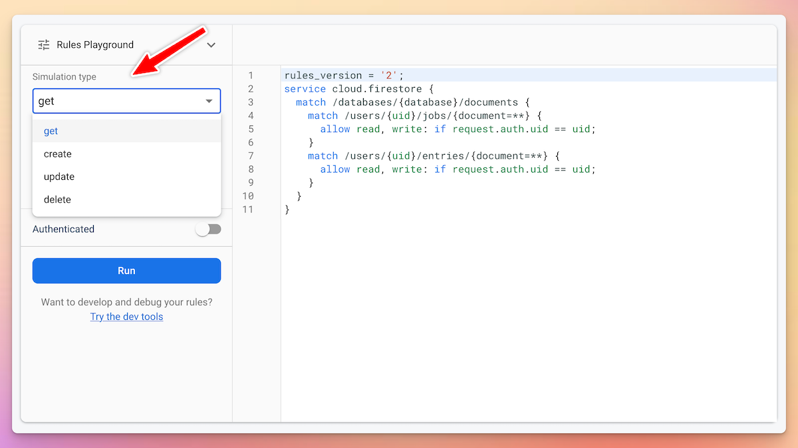
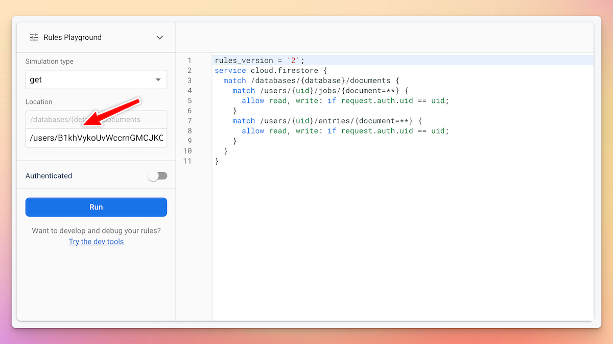
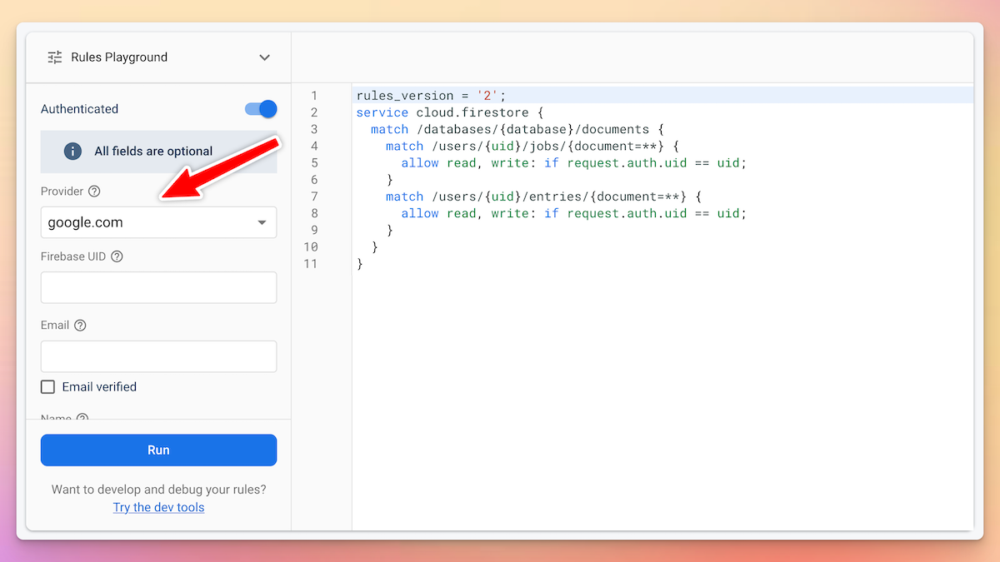
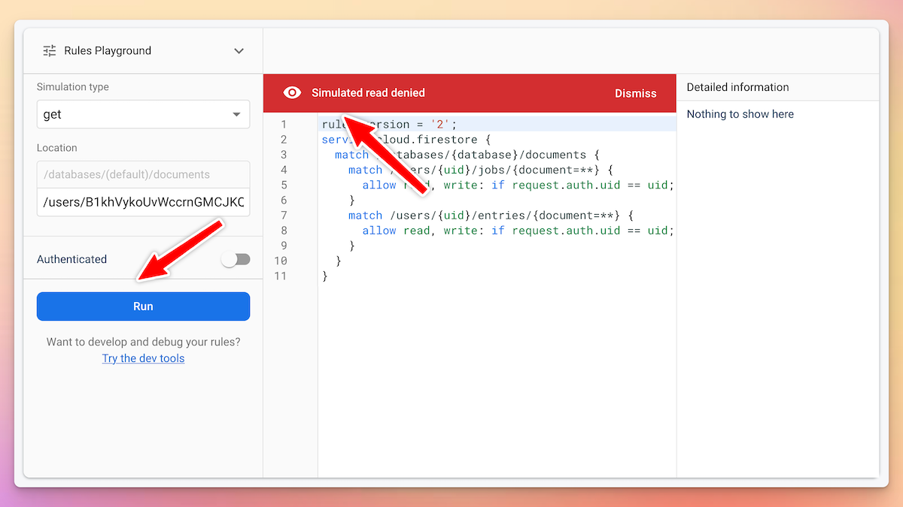
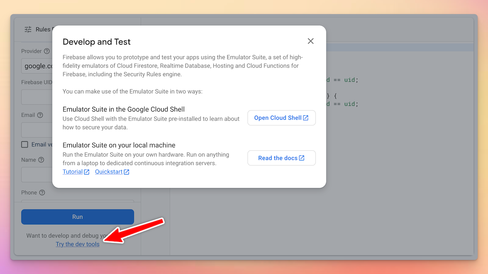

# Firestore Security Rules Playground

Did you know?

You can quickly test your Firestore security rules using the Rules Playground.

It's located in the bottom left corner. ↙

Here's how it works. 🧵

---

First of all, you have to choose what kind of operation you want to perform.

The available options are:

- get
- create
- update
- delete

---

Then, choose the location of the document that you want to test.

It doesn't matter if the document exists or not.

What matters is that the path points to a document-level location (not a collection).

---

If needed, you can simulate an authenticated request.

This allows you to specify the following parameters:

- authentication provider
- Firebase UID
- email (and whether it's verified or not)
- name
- phone number

---

Once you're ready, you can run the simulation.

And if it violates the security rules, you'll get a red banner with some details.

---

The rules playground is very handy when you're prototyping your security rules.

But if you want more control, you can use the Firebase Emulator Suite on your local machine or the Google Cloud Shell. 👇

---

Firebase is full of little nifty tools that make our life easier. 🔥

You can use it to build simple apps, all the way to complex full-stack apps.

And if you want to go deeper with Firebase, check out my latest course. 👇

- [Flutter & Firebase Masterclass](https://codewithandrea.com/courses/flutter-firebase-masterclass/)

---

### Found this useful? Show some love and share the [original tweet](https://twitter.com/biz84/status/1651212776113618944) 🙏

---

| Previous | Next |
| -------- | ---- |
| [Firestore OR queries 🔥](../0099-firestore-or-query/index.md) |  |
