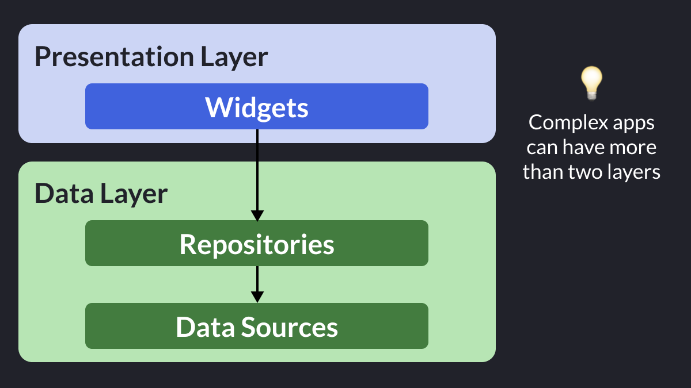
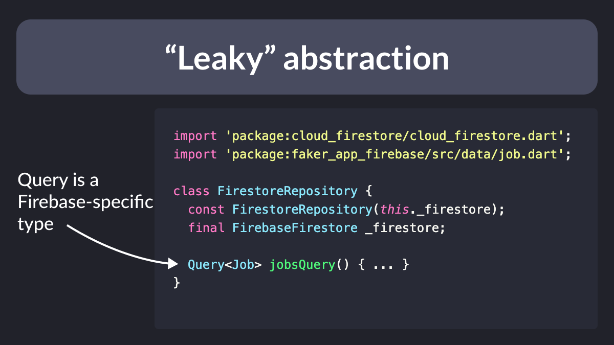
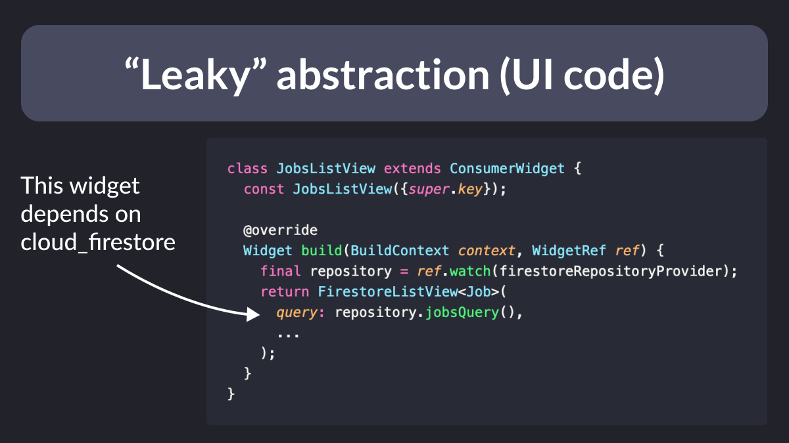
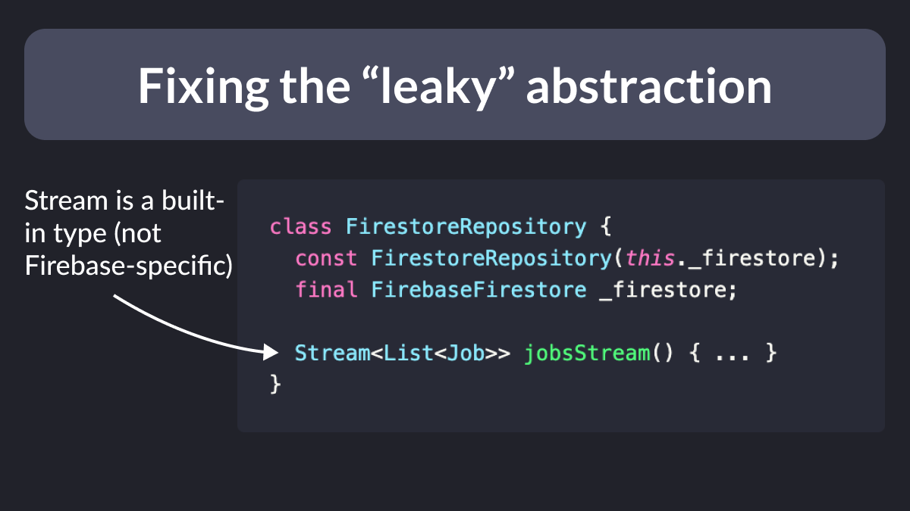

# Backend-agnostic Flutter apps

Does your Flutter app talk to a backend or server-side API?

Then it pays off to separate the UI code from your data-access layer.

Here are my tips to make your client code backend-agnostic. 🤔

Thread. 🧵

---

First of all, what does backend-agnostic mean?

Whether your app talks to a REST API or a remote database like Cloud Firestore, you don't want any of the *data-access* code to be mixed up with the UI.

Instead, put it into a separate data layer.

---

A very good way to do this is to use the repository pattern.

This lets you encapsulate all the data access logic (serialization, networking) inside a class.

And the rest of the app can talk to the *public interface* of that repository.

- [Flutter App Architecture: The Repository Pattern](https://codewithandrea.com/articles/flutter-repository-pattern/)

---

The repository pattern has several advantages:

- if the API changes, you only need to update the code in the repository
- your code becomes more testable (you can use a mock repository in your tests)
- migrating to a different backend becomes easier

---

This means that any UI code (or provider) that calls the `jobsQuery()` method will also depend on cloud_firestore.

---

So how can we prevent "leaky" abstractions?

The only way is to ensure that the **public** interface of the repository does not expose any Firebase-specific APIs.

Using the same example, this can be done by returning a `Stream<List<Job>>` rather than a `Query<Job>`.

---

But is that worthwhile?

After all, working with `Query` makes it easier to support pagination (with the [firebase_ui_firestore](https://pub.dev/packages/firebase_ui_firestore) package).

But if we work with streams directly, we have to do more work and implement pagination ourselves (not an easy task).

---

So when considering which abstractions to add, always weigh the pros and cons:

Moving the data-access code into a repository?
✅ Worth it (more testable and maintainable code) 

Replace `Query<Job>` with `Stream<List<Job>`?
❌ Maybe not (more work to implement pagination) 

---

Also note: different backends offer different features 👇

- Firebase gives you realtime listeners, caching, and offline mode
- But a simple REST API won't

So don't go for the lowest common denominator "because of abstraction".

Make the most of what your backend has to offer.

---

Choosing the right abstractions can be challenging.

If for a deeper dive into this topic, read this article:

- [How to use Abstraction and the Repository Pattern Effectively in your Flutter apps](https://codewithandrea.com/articles/abstraction-repository-pattern-flutter/)

---

### Found this useful? Show some love and share the [original tweet](https://twitter.com/biz84/status/1653050251262009355) 🙏

---

| Previous | Next |
| -------- | ---- |
| [Firestore Security Rules Playground](../0100-security-rules-playground/index.md) | [Storing API keys in a JSON file](../0102-dart-define-from-file/index.md) |
