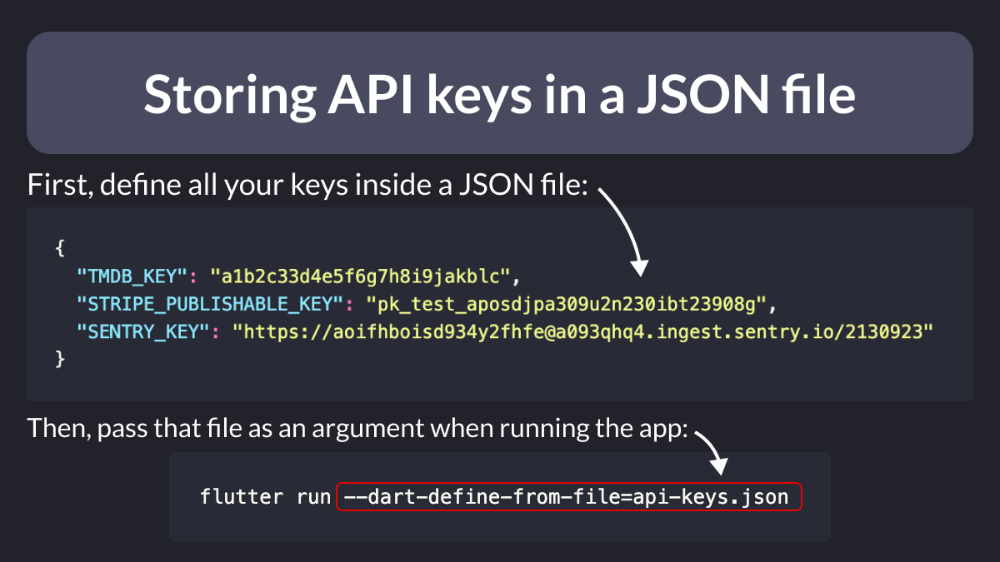
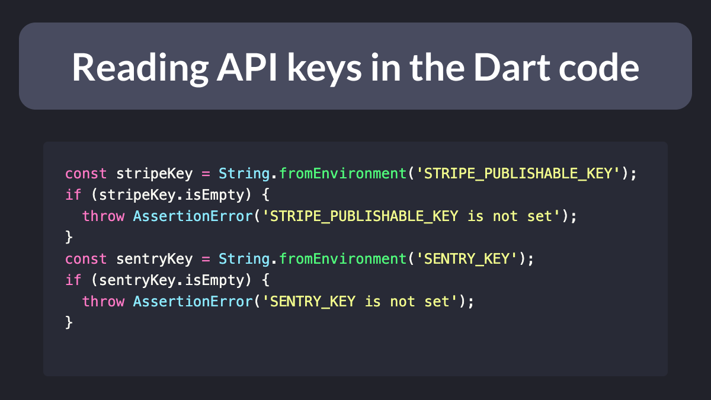

# Storing API keys in a JSON file

Did you know?

Since Flutter 3.7, you can store all your API keys inside a JSON file and pass it to a new `--dart-define-from-file` flag from the command line.

(you'll want to add that JSON file to .gitignore to avoid exposing your sensitive keys)

---

Then in your Dart code, simply use `String.fromEnvironment` to retrieve your keys and use them as needed. 👇

---

To learn about different techniques and best practices for storing API keys in Flutter, check out my (updated) article: 👇

- [How to Store API Keys in Flutter: --dart-define vs .env files](https://codewithandrea.com/articles/flutter-api-keys-dart-define-env-files/)

---

### Found this useful? Show some love and share the [original tweet](https://twitter.com/biz84/status/1651212776113618944) 🙏

---

| Previous | Next |
| -------- | ---- |
| [Backend-agnostic Flutter apps](../0101-backend-agnostic/index.md) | [[core/duplicate-app] A Firebase App named "[DEFAULT]" already exists](../0103-firebase-duplicate-app/index.md) |
