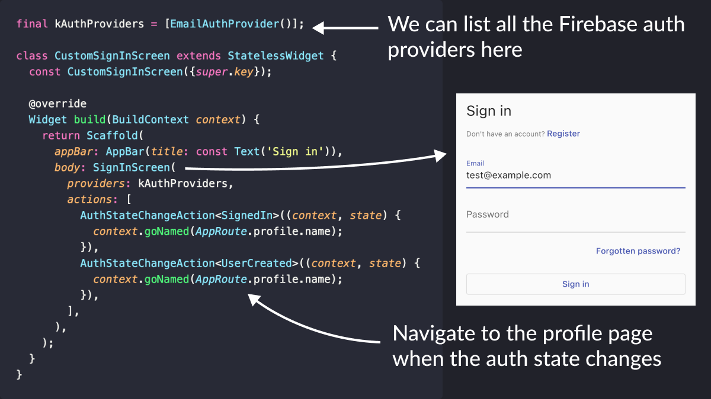
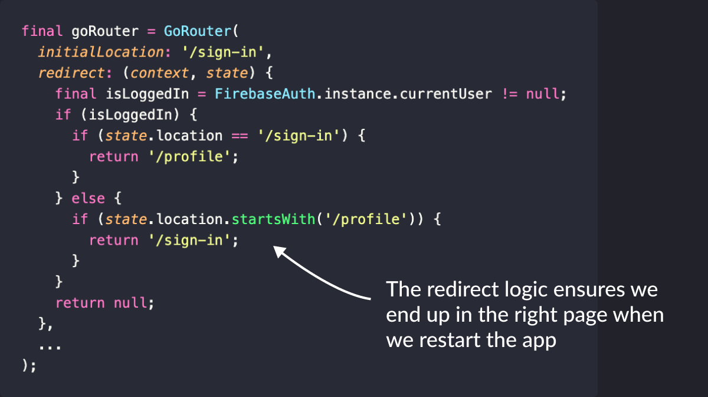
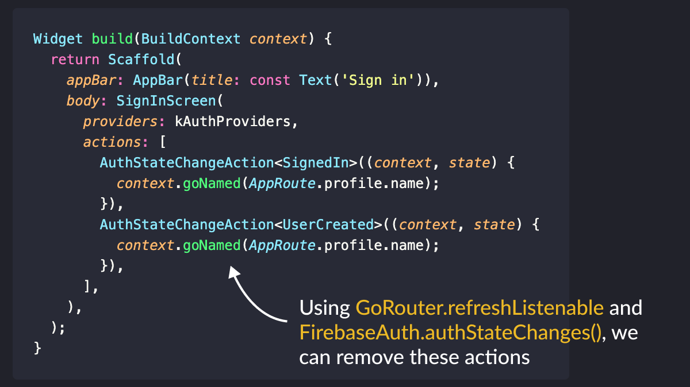

# Firebase Auth flow in 5 minutes

Did you know that with Firebase, you can create a full email & password sign-in flow in less than 5 minutes?

Let me show you how - using the Firebase UI and GoRouter packages.

Thread. 🧵

---

First of all, we need to add Firebase to our project.

This is easily done with the FlutterFire CLI and the standard Dart initialization code.

---

Next up, let's create a GoRouter instance with two routes: sign-in and profile.

Tip: we can also add an enum that we'll use to navigate by name (rather than by path).

Note that the `CustomSignInScreen` and `CustomProfileScreen` widgets don't exist yet. We'll add them shortly.

---

Then, let's define the top-level widget for our app.

Note that we use the `MaterialApp.router` API, passing the `goRouter` object we created before.

For non-trivial apps, we'll most likely want to store the goRouter inside a provider, rather than as a global variable.

---

Widget time!

Let's create a `CustomSignInScreen` that we'll use to show the email & password sign-in flow.

If you want more than one sign-in provider, you can add it to the `kAuthProviders` list.

Also, note the use of actions to navigate to the profile page.

---

Let's add the `CustomProfileScreen` as well!

This is quite easy and just a case of using the built-in ProfileScreen widget.

In this case, we also use an action to navigate back to the sign-in page.

---

And now, we can already test the app and see that it correctly navigates from the sign-in page to the profile page and vice-versa.

But there's a problem.

If we are already signed in and we hot restart, the navigation state is reset, and we end up on the sign-in page again. 🧐

----

To fix that, we can add a GoRouter redirect to ensure that:

- we are redirected to the profile page if the user is signed in
- we are redirected to the sign-in page if the user is not signed in

And if we hot restart now, everything works as intended.

---

Job done!

In just 100 lines of code, we have a working email & password auth flow.

And we also get forgotten password & email verification features for free!

Here's a gist with the full implementation:

- [Simple Emil & Password auth flow with Flutter & Firebase UI](https://gist.github.com/bizz84/854988eea07a4264d7024f847f8bf070)

---

The code works, but there are still a few things we could improve.

For a start, using actions for the navigation logic is not very reactive.

To address that, we could remove all the actions and rely on `GoRouter.refreshListenable` instead.

---

Also note the usage of singletons (`FirebaseAuth.instance`) and global variables (`goRouter`, `kAuthProviders`).

We could put all these inside providers using the Riverpod package. 👌

---

If you want to go deeper with Flutter & Firebase, consider taking my new course.

Inside, you'll find many practical tips and best practices that will help you write maintainable apps.

Check it out here. 👇

- [Flutter & Firebase Masterclass](https://codewithandrea.com/courses/flutter-firebase-masterclass/)

---

### Found this useful? Show some love and share the [original tweet](https://twitter.com/biz84/status/1653384017092263945) 🙏

---

| Previous | Next |
| -------- | ---- |
| [Storing API keys in a JSON file](../0102-dart-define-from-file/index.md) | [[core/duplicate-app] A Firebase App named "[DEFAULT]" already exists](../0104-firebase-duplicate-app/index.md) |
