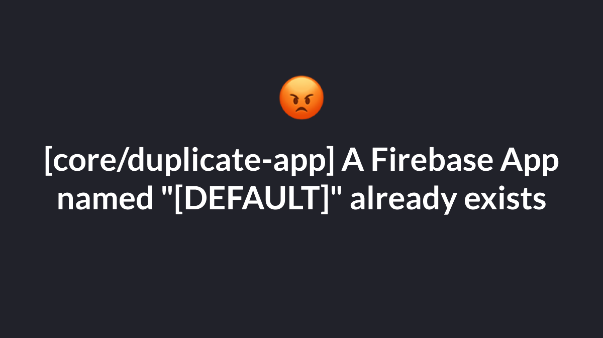
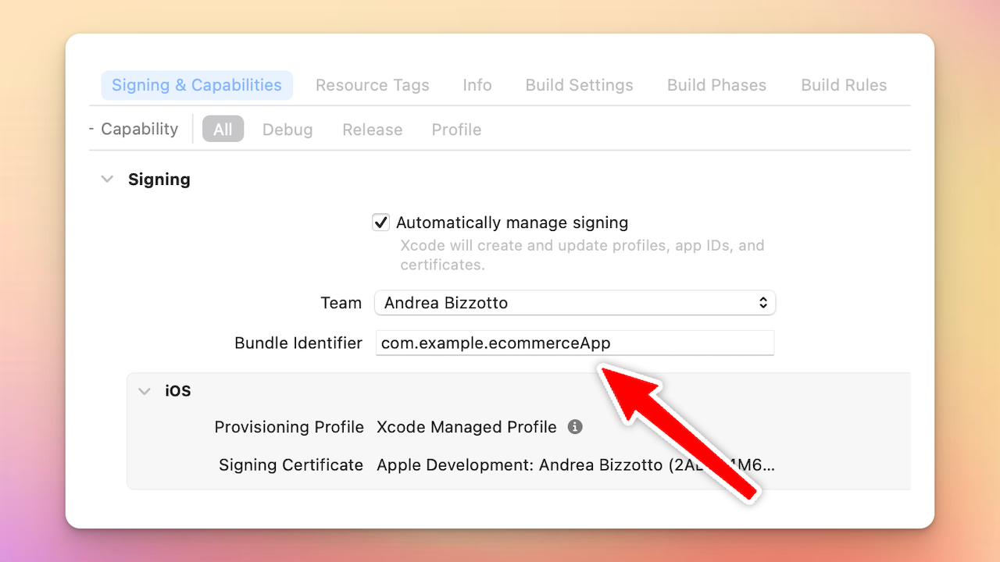
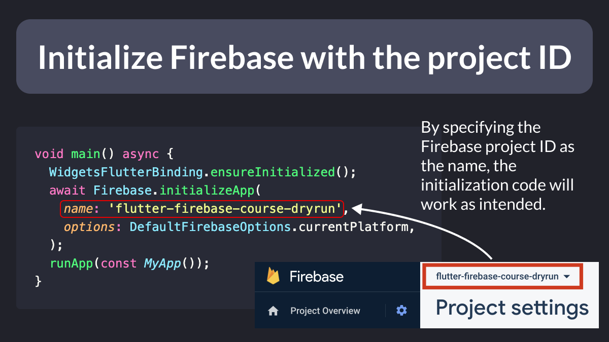

# [core/duplicate-app] A Firebase App named "[DEFAULT]" already exists

Have you ever encountered this error when running your Flutter app on iOS or macOS?

[core/duplicate-app] A Firebase App named "[DEFAULT]" already exists

The first time it happened to me, it took me hours to figure it out. 😤

But as it turns out, there's an easy solution. 👇

---

First of all, just know that this issue is showing up quite a bit on StackOverflow and GitHub.

There are multiple reasons you may encounter it.

But none of the solutions I found online worked for me: 

https://duckduckgo.com/?q=%5Bcore%2Fduplicate-app%5D+A+Firebase+App+named+%22%5BDEFAULT%5D%22+already+exists&t=ffab&ia=web

---

Here's what went wrong in my case.

I had two separate Firebase projects using *THE SAME* iOS (or macOS) bundle ID.

As a result, the Dart initialization code couldn't decide which Firebase project to use.

FYI, here's where to find the iOS bundle ID. 👇

---

If you find yourself in the same situation, the easiest solution is to specify a "name" parameter when calling Firebase.initializeApp().

And give it the Firebase project ID as an argument. 👇

---

Once again, this will solve the problem if you have two or more Firebase projects using *THE SAME* iOS (or macOS) bundle ID.

But it's not the only reason you may get this error.

I just wanted to share this as it may save you a few hours of frustration. 🥲

---

If you wanna dive deeper with Firebase, check out my new course, where you'll build a full-stack eCommerce app and learn about all the most important Firebase features. 👇

https://codewithandrea.com/courses/flutter-firebase-masterclass/

---

### Found this useful? Show some love and share the [original tweet](https://twitter.com/biz84/status/1651212776113618944) 🙏

---

| Previous | Next |
| -------- | ---- |
| [Storing API keys in a JSON file](../0102-dart-define-from-file/index.md) |  |
