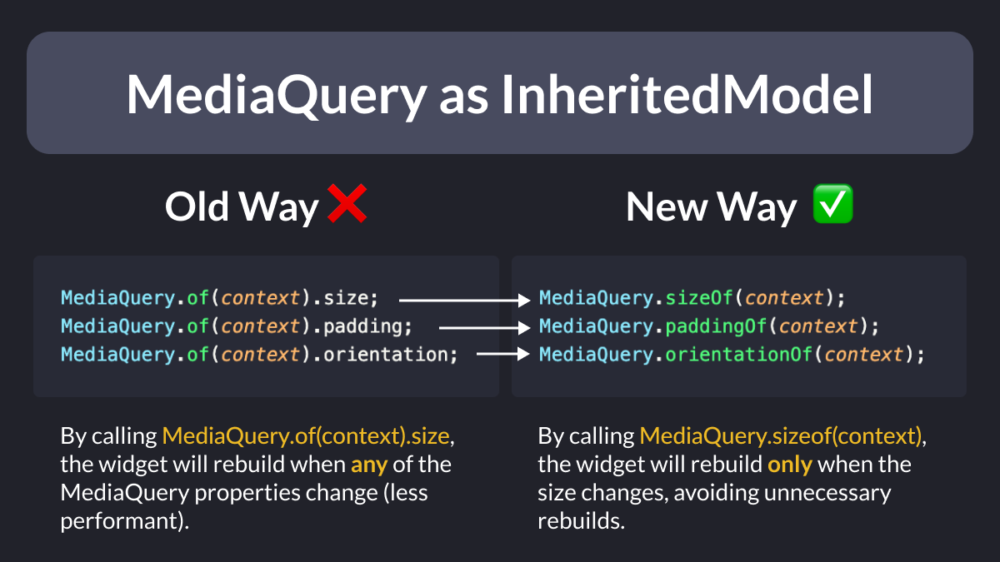

# MediaQuery as InheritedModel

Did you know?

When you call `MediaQuery.of(context)` inside a build method, the widget will rebuild when *any* of the `MediaQuery` properties change.

But there's a better way that lets you depend only on the properties you care about (and minimize unnecessary rebuilds). 👇

---

More info on this PR, which was merged and made it to the Flutter 3.10 stable release:

- [MediaQuery as InheritedModel](https://github.com/flutter/flutter/pull/114459)

---

### Found this useful? Show some love and share the [original tweet](https://twitter.com/biz84/status/1671085759858606081) 🙏

---

| Previous | Next |
| -------- | ---- |
| [Happy Birthday with records in Dart 3](../0107-happy-birthday-records-dart-3/index.md) | |
