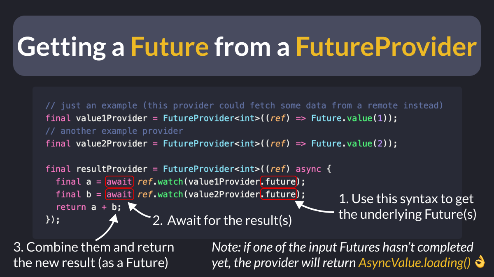

# Getting a `Future` from a `FutureProvider` with Riverpod

Did you know?

If you have a Riverpod `FutureProvider`, there’s an easy way to get the underlying `Future`.

Very handy when you want to await multiple Futures and combine the result.

Works with `StreamProvider` and `Stream` too. 👌

---

### Found this useful? Show some love and share the [original tweet](https://twitter.com/biz84/status/1673702960046514176) 🙏

---

| Previous | Next |
| -------- | ---- |
| [Record Equality in Dart 3](../0109-records-equality/index.md) | |
