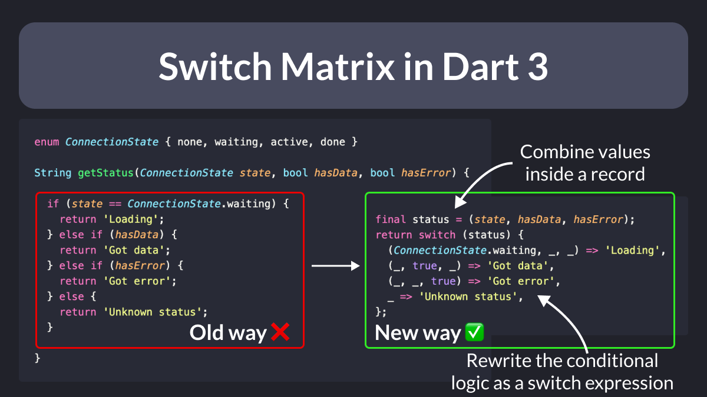

# Switch Matrix in Dart 3

Did you know?

Since Dart 3, you can combine multiple variables into a record and replace if-else chains with a switch expression. ✅

This is known as a switch matrix and lets you apply pattern matching to multiple values at once. 👌

---

This tip was inspired by Pascal Welsch's talk about Records and patterns at FlutterCon.

Slides here:

- [Exploring Records and Patterns | FlutterCon Berlin 2023 slides](https://docs.google.com/presentation/d/10qpjH16WISV5lYV1bR0r3USB4ggjReA7PjcyK1KyhDE/edit#slide=id.g14d15a4acf1_0_10)

---

### Found this useful? Show some love and share the [original tweet](https://twitter.com/biz84/status/1679067058909110273) 🙏

---

| Previous | Next |
| -------- | ---- |
| [Destructuring Lists in Dart](../0111-destructure-lists-dart/index.md) | |
