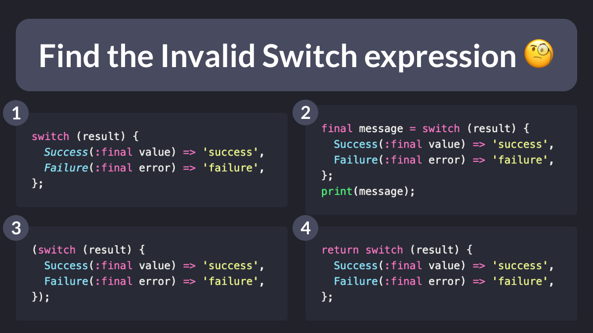
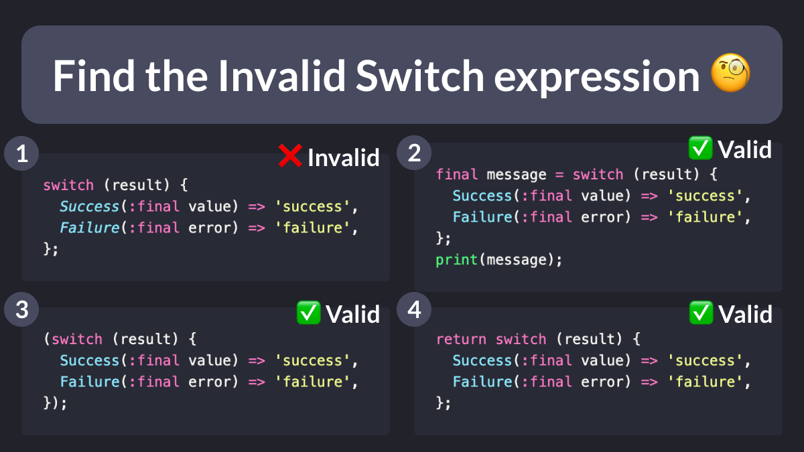

# Find the Invalid Switch Expression 🧐

Did you know?

One of the four snippets below is invalid (won't compile).

Can you guess which one and why?

---

According to the language specification, you can’t begin a switch expression at the beginning of a line.

To solve this:

- assign the expression to a variable (option 2)
- wrap the expression with parenthesis (option 3)
- return the expression (option 4)

---

### Found this useful? Show some love and share the [original tweet](https://twitter.com/biz84/status/1679472787495215106) 🙏

---

| Previous | Next |
| -------- | ---- |
| [6 steps to minimize your Firebase Bill](../0114-minimize-firebase-bill/index.md) | [Measuring execution time in Dart](../0116-measure-time/index.md) |
