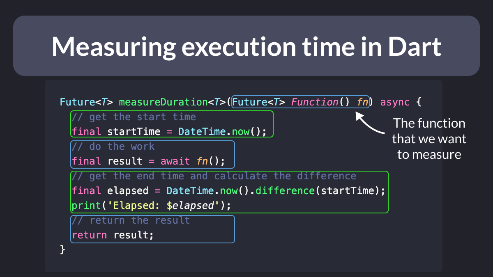
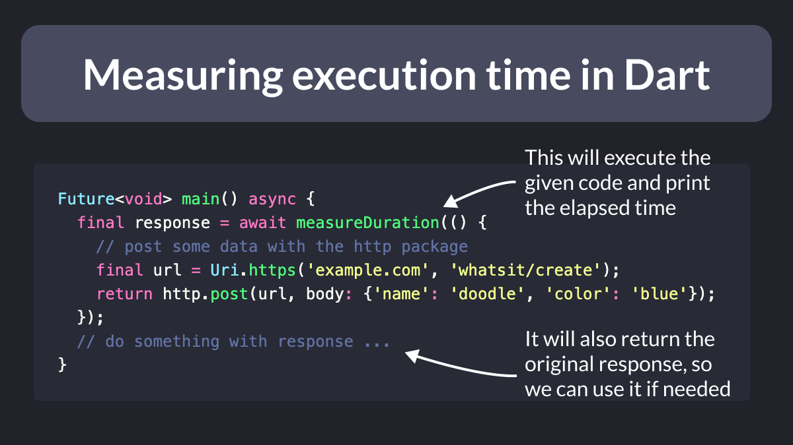

# Measuring execution time in Dart

Ever wanted to measure how long a network request takes in Dart?

This is easily done by creating a helper function that calculates the difference between two dates. 👇

---

Then, you can wrap any asynchronous code block inside the function and reuse it as needed.

Very useful for benchmarking the execution time of your backend or database calls. 👌

---

### Found this useful? Show some love and share the [original tweet](https://twitter.com/biz84/status/1696517265985093781) 🙏

---

| Previous | Next |
| -------- | ---- |
| [Find the Invalid Switch Expression 🧐](../0115-switch-newline/index.md) | [Are global variables bad?](../0117-are-global-variables-bad/index.md) |
