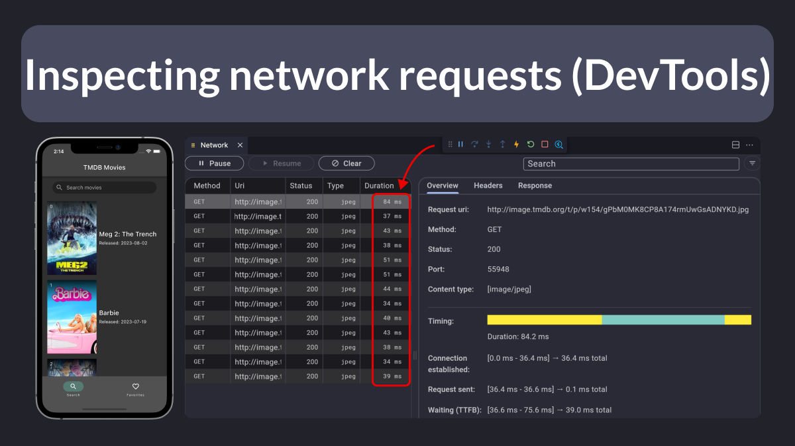

# How to Inspect Network Requests with the Flutter DevTools

Ever wanted to measure how long network requests take in your Flutter app without writing any code?

Then, just run your app and open the “DevTools Network Page” from the command palette.

As you use your app, all the network requests will be logged so you can inspect them. 👌

---

There's so much more you can do with the Network View.

To learn more, I recommend reading this article:

- [Mastering Dart & Flutter DevTools — Part 4: Network View](https://medium.com/@fluttergems/mastering-dart-flutter-devtools-network-view-part-4-of-8-afce2463687c)

---

### Found this useful? Show some love and share the [original tweet](https://twitter.com/biz84/status/1699055590495203688) 🙏

---

| Previous | Next |
| -------- | ---- |
| [Are global variables bad?](../0117-are-global-variables-bad/index.md) |  |