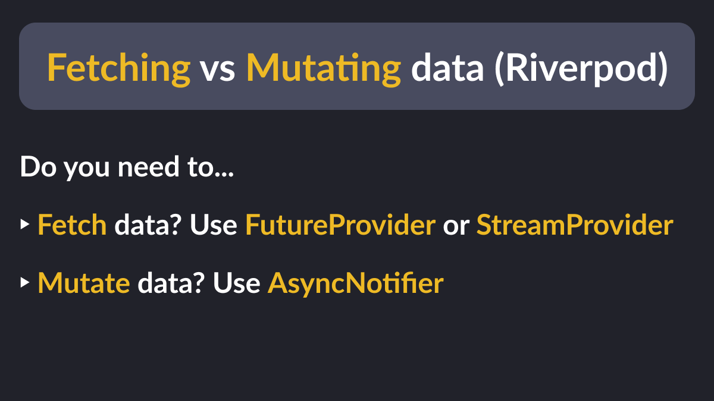

# Fetching vs Mutating data with Riverpod

Data fetching and data mutations are two important concerns when building mobile apps.

Riverpod can handle both, as long as you choose the correct class or provider:

- Fetching data? Use `FutureProvider` or `StreamProvider`
- Mutating data? Use `AsyncNotifier`

---

### Found this useful? Show some love and share the [original tweet](https://twitter.com/biz84/status/1704486985925099958) 🙏

---

| Previous | Next |
| -------- | ---- |
| [Flutter web: redirect to an external URL](../0120-set-html-window-url/index.md) | [Top reasons for using a realtime backend](../0122-user-realtime-backend/index.md) |

