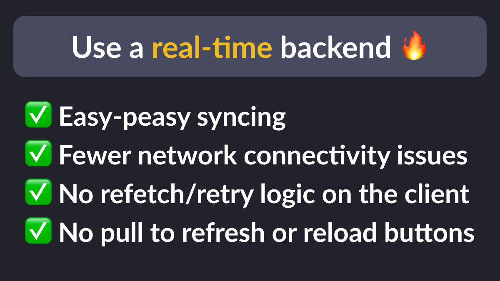

# Top reasons for using a realtime backend

- easy-peasy syncing across devices
- fewer network connectivity issues (Firebase is really good at this)
- no need for complex refetch/retry logic on the client
- no need for pull to refresh and reload buttons (better UX)

---

### Found this useful? Show some love and share the [original tweet](https://twitter.com/biz84/status/1707026963469062651) 🙏

---

| Previous | Next |
| -------- | ---- |
| [First steps to tackle when starting a new mobile app](../0122-first-steps-new-app/index.md) | [Payment options on mobile and web](../0124-payment-options-mobile-web/index.md) |

