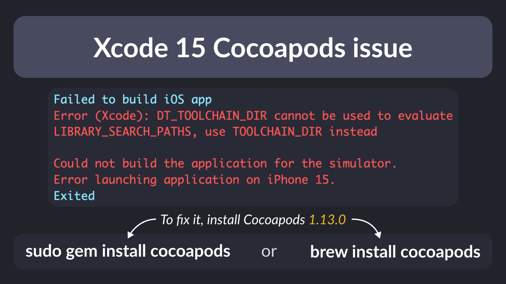

# Xcode 15 DT_TOOLCHAIN_DIR issue

When updating to Xcode 15, you're likely to get this error when building your Flutter apps.

The fastest and easiest way to fix this is to install the latest Cocoapods (**1.13.0**).

---

### Found this useful? Show some love and share the [original tweet](https://twitter.com/biz84/status/1709225405637382171) 🙏

---

| Previous | Next |
| -------- | ---- |
| [Payment options on mobile and web](../0124-payment-options-mobile-web/index.md) |  |

