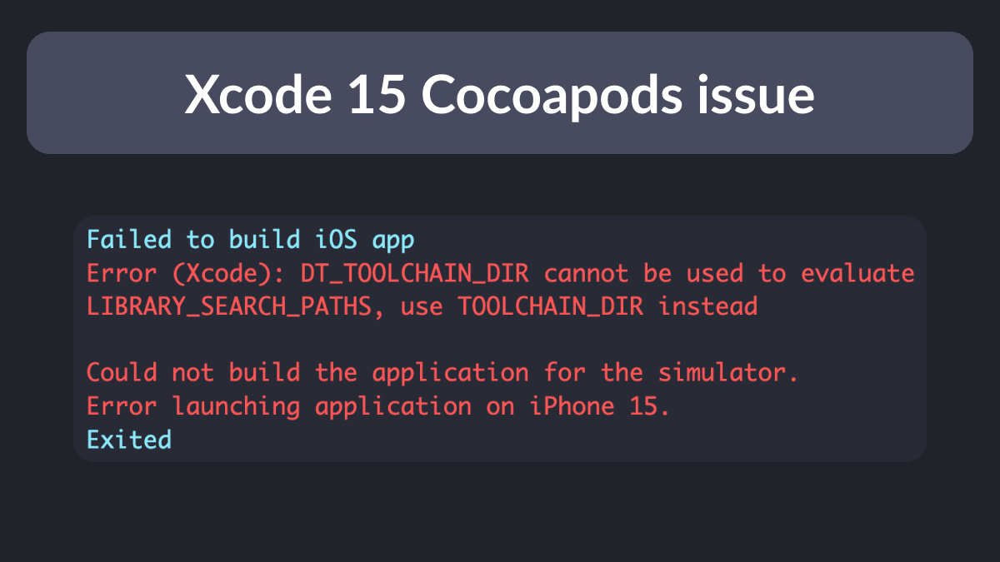
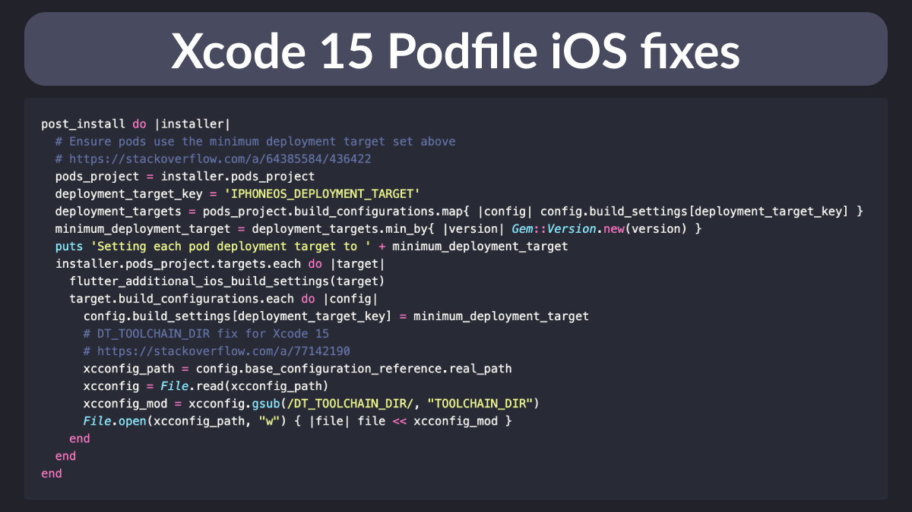
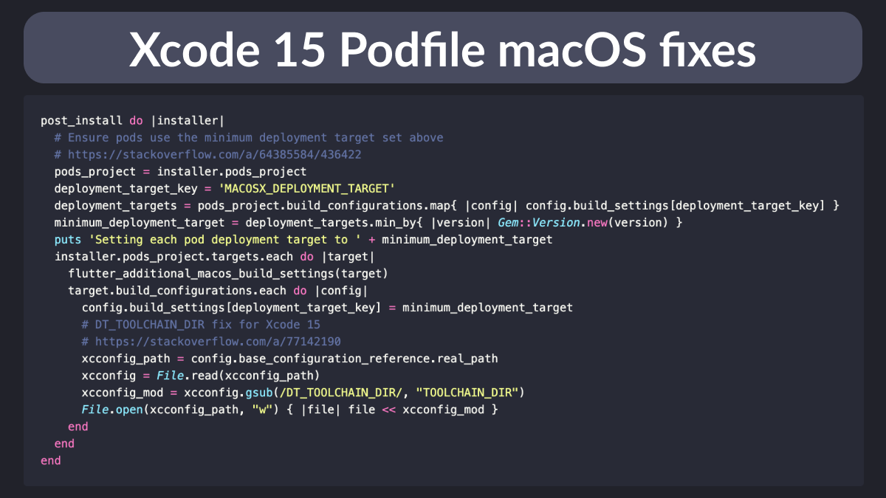

# Xcode 15 DT_TOOLCHAIN_DIR issue

When updating to Xcode 15, you're likely to get this error when building your Flutter apps.

See below for how to fix it. 👇



---

The main trick is to add this sourcery to the iOS Podfile.

(Maybe it's me, but with every new Xcode version I have to keep adding hacks to make this work 😱).



You can use this template Podfile on iOS:

```ruby
# Set the platform at the top
platform :ios, '13.0'

# Rest of the pod file

# Update post_install step
post_install do |installer|
  # Ensure pods use the minimum deployment target set above
  # https://stackoverflow.com/a/64385584/436422
  pods_project = installer.pods_project
  deployment_target_key = 'IPHONEOS_DEPLOYMENT_TARGET'
  deployment_targets = pods_project.build_configurations.map{ |config| config.build_settings[deployment_target_key] }
  minimum_deployment_target = deployment_targets.min_by{ |version| Gem::Version.new(version) }
  puts 'Setting each pod deployment target to ' + minimum_deployment_target
  installer.pods_project.targets.each do |target|
    flutter_additional_ios_build_settings(target)
    target.build_configurations.each do |config|
      config.build_settings[deployment_target_key] = minimum_deployment_target
      # DT_TOOLCHAIN_DIR fix for Xcode 15
      # https://stackoverflow.com/a/77142190
      xcconfig_path = config.base_configuration_reference.real_path
      xcconfig = File.read(xcconfig_path)
      xcconfig_mod = xcconfig.gsub(/DT_TOOLCHAIN_DIR/, "TOOLCHAIN_DIR")
      File.open(xcconfig_path, "w") { |file| file << xcconfig_mod }
    end
  end
end
```

---

To run on macOS, you need to do something *very* similar but not quite identical.

In my Podfile, the following lines are different on macOS:

- `deployment_target_key = "MACOS_DEPLOYMENT_TARGET"`
- `flutter_additional_macos_build_settings(target)`



You can use this template Podfile on macOS:

```ruby
# Set the platform at the top
platform :osx, '10.15'

# Rest of the pod file

# Update post_install step
post_install do |installer|
  # Ensure pods use the minimum deployment target set above
  # https://stackoverflow.com/a/64385584/436422
  pods_project = installer.pods_project
  deployment_target_key = 'MACOSX_DEPLOYMENT_TARGET'
  deployment_targets = pods_project.build_configurations.map{ |config| config.build_settings[deployment_target_key] }
  minimum_deployment_target = deployment_targets.min_by{ |version| Gem::Version.new(version) }
  puts 'Setting each pod deployment target to ' + minimum_deployment_target
  installer.pods_project.targets.each do |target|
    flutter_additional_macos_build_settings(target)
    target.build_configurations.each do |config|
      config.build_settings[deployment_target_key] = minimum_deployment_target
      # DT_TOOLCHAIN_DIR fix for Xcode 15
      # https://stackoverflow.com/a/77142190
      xcconfig_path = config.base_configuration_reference.real_path
      xcconfig = File.read(xcconfig_path)
      xcconfig_mod = xcconfig.gsub(/DT_TOOLCHAIN_DIR/, "TOOLCHAIN_DIR")
      File.open(xcconfig_path, "w") { |file| file << xcconfig_mod }
    end
  end
end
```

---

### Found this useful? Show some love and share the [original tweet](https://twitter.com/biz84/status/1709225405637382171) 🙏

---

| Previous | Next |
| -------- | ---- |
| [Payment options on mobile and web](../0124-payment-options-mobile-web/index.md) |  |

