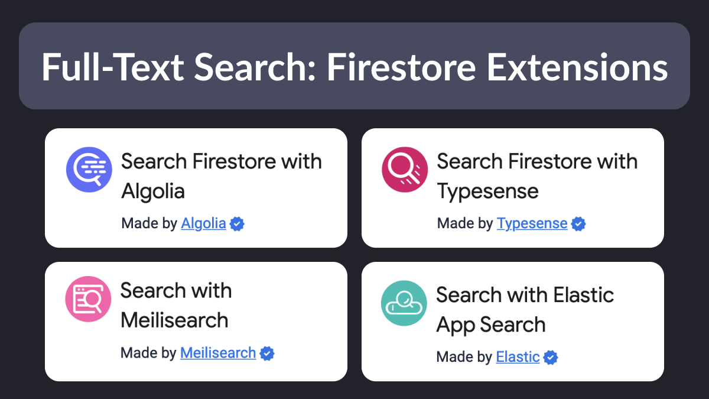

# Full-Text Search: Firestore Extensions

Ever needed to add a “search-as-you-type” feature to your Flutter & Firebase app?

As it turns out, Firestore doesn’t support full-text search as a built-in feature yet.

To work around this, you can choose one of the available Firestore extensions. 👇

---

Note that all the providers above are paid products.

Some of them have a free plan that you can use to get started. 👍

But make sure to check the pricing for each product to avoid surprises later on.

Here's a pricing comparison table that you can use for reference. 👇

---

Of course, pricing is not the only thing that matters.

For a comparison of all the supported features, check this page on the Typesense website: 👇

- [Compare Algolia vs ElasticSearch vs Meilisearch vs Typesense](https://typesense.org/typesense-vs-algolia-vs-elasticsearch-vs-meilisearch/)

---

I'll be covering Firestore search with Algolia in the upcoming module of my Flutter & Firebase course.

For all the details, check the course page: 👇

- [Flutter & Firebase Masterclass](https://codewithandrea.com/courses/flutter-firebase-masterclass/)

---

### Found this useful? Show some love and share the [original tweet](https://twitter.com/biz84/status/1714265768668398050) 🙏

---

| Previous | Next |
| -------- | ---- |
| [How to work with webhooks?](../0126-webhooks/index.md) |  |

