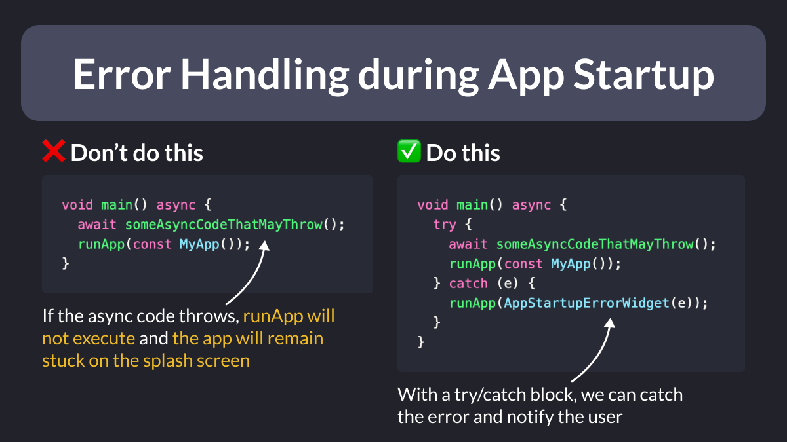

# Error Handling during App Startup

Did you know?

If you run some async initialization code **before** calling `runApp()` and an exception is thrown, the app will remain stuck on the splash screen. 😳

To prevent this, wrap your code with a try/catch block and notify the user that something went wrong. 👍

---

### Found this useful? Show some love and share the [original tweet](https://twitter.com/biz84/status/1719741960586469824) 🙏

---

| Previous | Next |
| -------- | ---- |
| [Full-Text Search: Firestore Extensions](../0127-full-text-search/index.md) |  |

