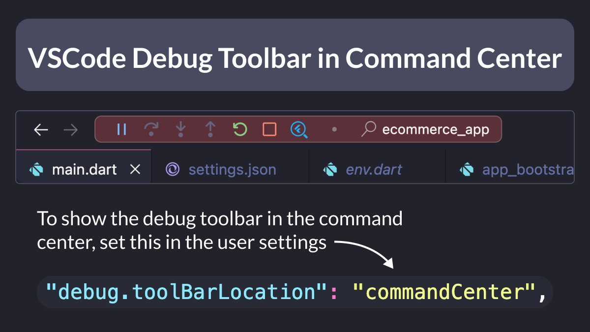

# VSCode Debug Toolbar in Command Center

Did you know?

You can now show the Debug Toolbar in the Command Center in VSCode. 🎉

To do this, add the following line to the settings file:

```json
"debug.toolBarLocation": "commandCenter"
```

Happy coding! 💻



---

### Found this useful? Show some love and share the [original tweet](https://twitter.com/biz84/status/1720070673413054484) 🙏

---

| Previous | Next |
| -------- | ---- |
| [Error Handling during App Startup](../0128-error-handling-app-startup/index.md) |  |
