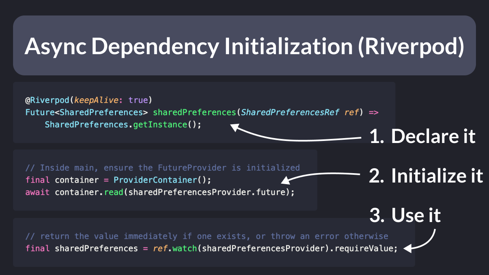
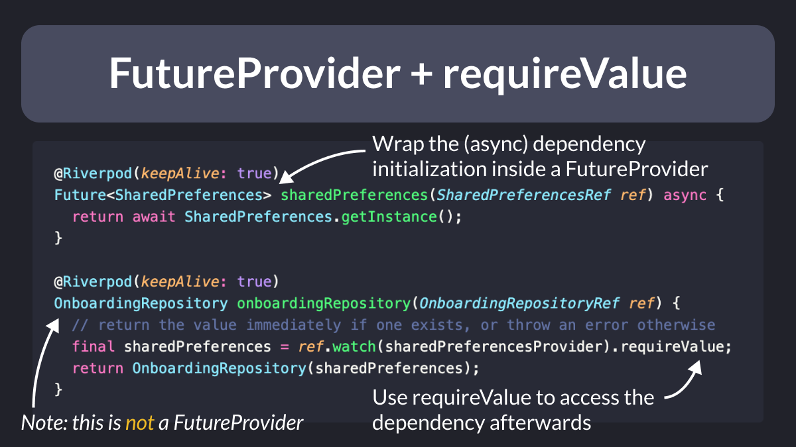
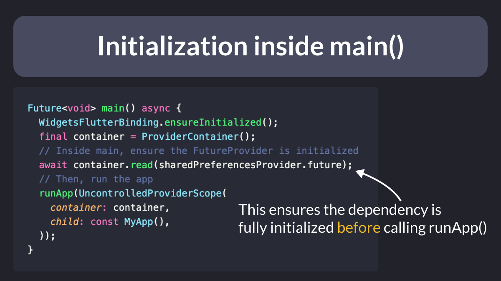
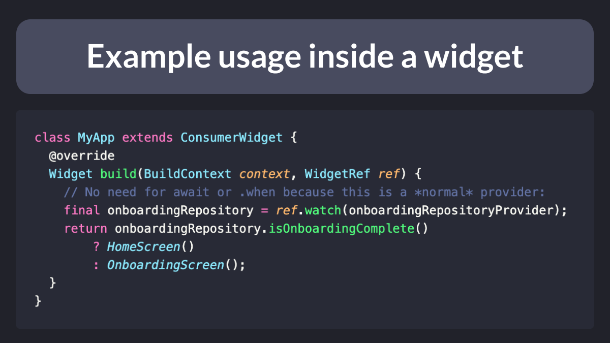

# Async Dependency Initialization with `requireValue` (Riverpod)

How do you initialize an async dependency during app startup, and use it *synchronously* afterwards?

With Riverpod, this is done in 3 simple steps:

1. Declare it inside a `FutureProvider`
2. Initialize it inside `main()`
3. Use `requireValue` afterwards

Details in thread below 🧵

---

The key steps are to:

- declare and initialize the dependency inside a FutureProvider
- access the dependency with `requireValue` whenever needed (inside other providers or widgets)

But `requireValue` will throw unless there is a value already.

---

To address this, we can create a `ProviderContainer` inside `main()` and await until the `FutureProvider` is initialized.

---

As a result, any providers or widgets that depend (directly or indirectly) on the original FutureProvider only contain synchronous code.

So no `await` or `.when` is needed.

---

I used to solve this problem by:

- throwing an `UnimplementedError` inside the `FutureProvider`
- initializing the dependency with a provider override inside `main()`

But this approach much nicer and easier to follow. 🙂

Happy coding!

---

### Found this useful? Show some love and share the [original tweet](https://twitter.com/biz84/status/1724443435346604214) 🙏

---

| Previous | Next |
| -------- | ---- |
| [8 Steps to Follow When Building Your Next Flutter App](../0130-steps-to-follow-next-flutter-app/index.md) | [Highlight oversized images with the Flutter DevTools](../0132-highlight-oversized-images/index.md) |

