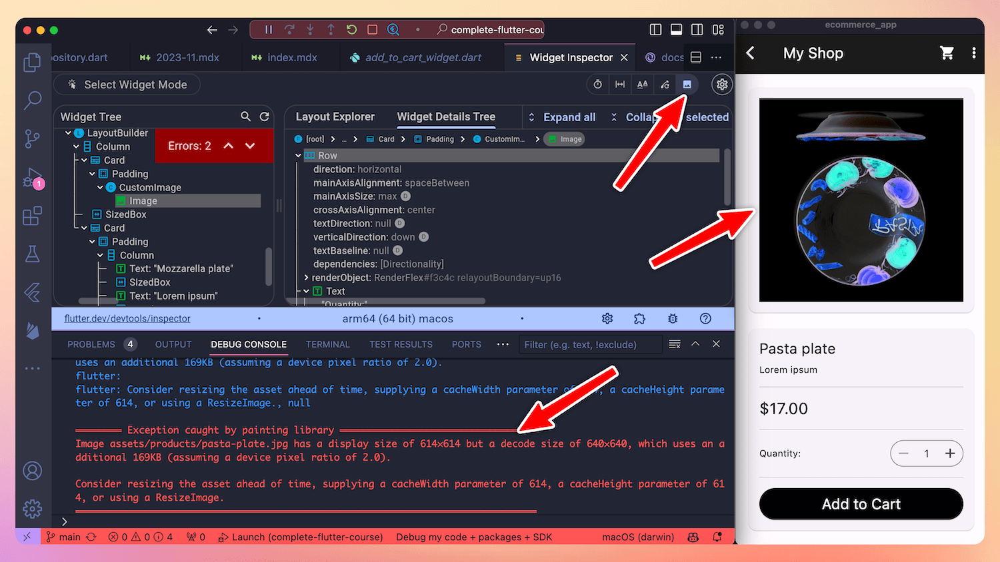

# Highlight oversized images with the Flutter DevTools

Did you know?

The Flutter DevTools has an option to highlight images that are too large (this is a big problem if your app has many images, especially on mobile).

Once enabled, all oversized images will appear flipped and with inverted colors, so you can resize them as needed.



---

If desired, you can achieve the same effect by setting this flag inside your `main()`:

```dart
debugInvertOversizedImages = true;
```

More info here:

- [Highlight oversized images | Flutter docs](https://docs.flutter.dev/tools/devtools/inspector#highlight-oversized-images)

### Found this useful? Show some love and share the [original tweet](https://twitter.com/biz84/status/1724443435346604214) 🙏

---

| Previous | Next |
| -------- | ---- |
| [Async Dependency Initialization with `requireValue` (Riverpod)](../0131-future-provider-require-value/index.md) |  |

