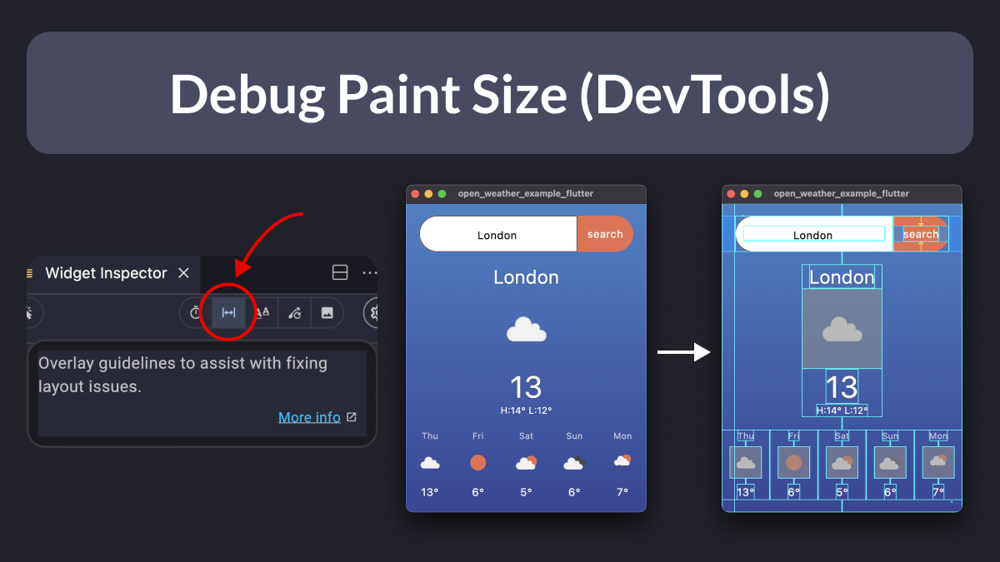

# Debug Paint Size (DevTools)

Did you know?

The Flutter widget inspector has a toggle that will help you see the boundaries for each widget in your app.

This is great for debugging layout issues visually. 👇

---

Want more fine-grained control and enable debug paint only for a specific widget subtree?

Then, you can use this great little package by [@devangelslondon](https://twitter.com/devangelslondon) and debug like a pro:

- [`devangels_show_debug_paint`](https://pub.dev/packages/devangels_show_debug_paint)

---

### Found this useful? Show some love and share the [original tweet](https://twitter.com/biz84/status/1727699486497976402) 🙏

---

| Previous | Next |
| -------- | ---- |
| [SelectionArea across multiple widgets](../0133-selection-area/index.md) |  |

