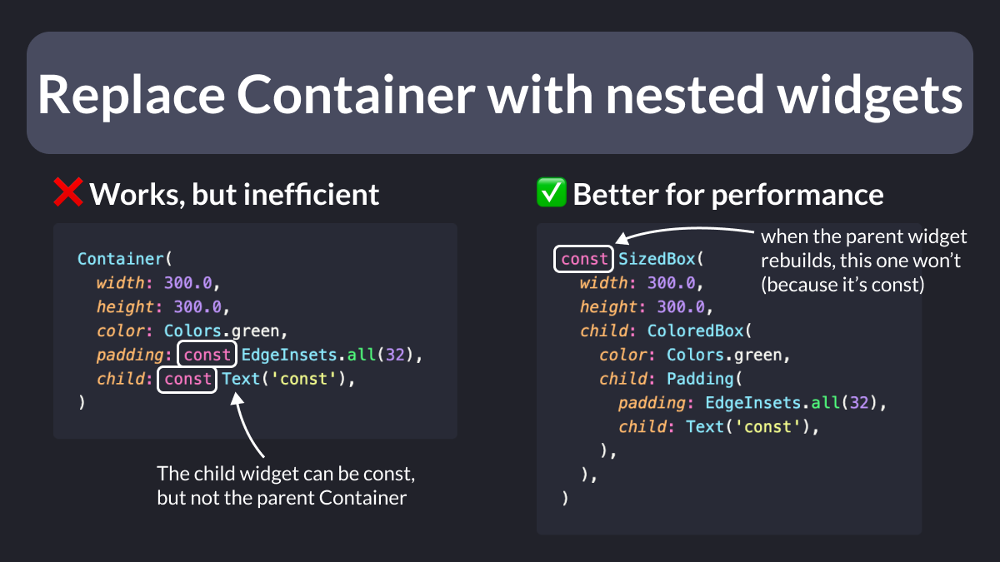

# Replace `Container` with nested widgets

With Flutter, you can use a `Container` to combine painting, positioning, and sizing properties.

But should you?

As it turns out, `Container` doesn't have a `const` constructor.

So, consider replacing it with dedicated widgets that *do* have a `const` constructor. 👍

---

### Found this useful? Show some love and share the [original tweet](https://twitter.com/biz84/status/1729114620512887056) 🙏

---

| Previous | Next |
| -------- | ---- |
| [Debug Paint Size (DevTools)](../0134-debug-paint-size/index.md) | [Use `IntrinsicWidth`, not fixed width](../0136-intrinsic-width/index.md) |
