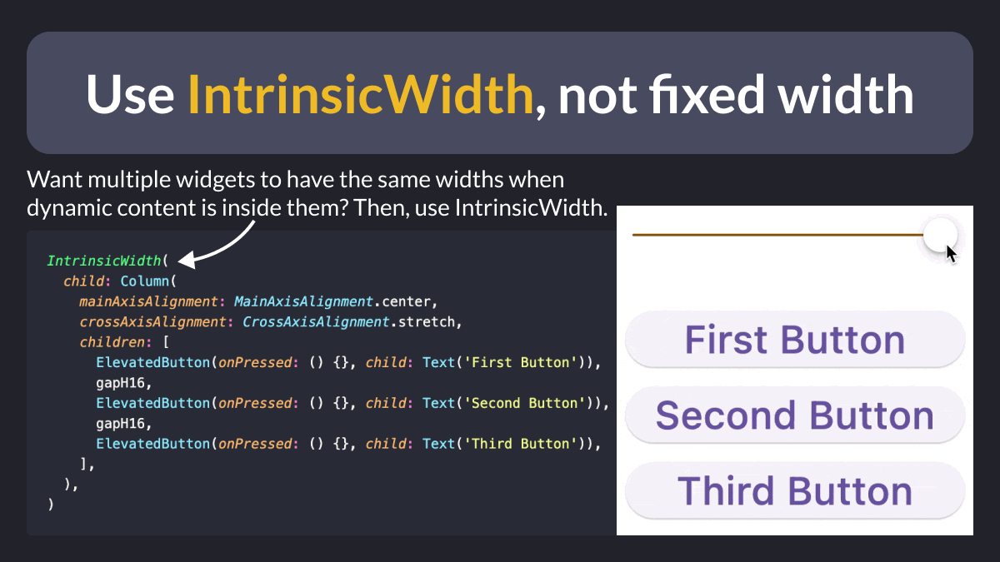

# Use `IntrinsicWidth`, not fixed width

Ever tried to force multiple `Text` widgets to have the same fixed width (e.g. with a parent `SizedBox`)?

Don’t do that, as this will break your layout when the text size changes.

Instead, use `IntrinsicWidth` and let Flutter calculate the right size for you. 👍

---

Credit for this tip goes to [@devangelslondon](https://twitter.com/devangelslondon), who showcased it during his talk at FlutterCon 23:

- [Flutter tips and tricks | FlutterCon 23](https://www.droidcon.com/2023/08/06/flutter-tips-and-tricks/)

---

### Found this useful? Show some love and share the [original tweet](https://twitter.com/biz84/status/1729520341125386420) 🙏

---

| Previous | Next |
| -------- | ---- |
| [Replace `Container` with nested widgets](../0135-replace-container-nested-widgets/index.md) | [Combining Streams with RxDart](../0137-rxdart-combine-latest/index.md) |
