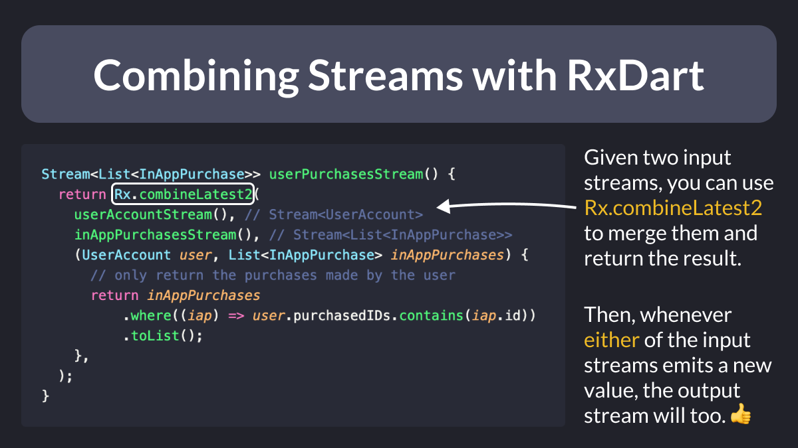

# Combining Streams with RxDart

Ever needed to combine 2 or more streams and show the result in the UI?

My favourite solution is to use combineLatestX from the RxDart package.

This is quite common when using a real-time DB like Cloud Firestore, and here's how it works. 👇

---

I've covered the same topic in more detail in this article, which also illustrates some tradeoffs and alternative implementations you could consider:

- [RxDart by example: combineLatest and data modeling with Firestore](https://codewithandrea.com/videos/rx-dart-by-example-combine-latest/)

---

### Found this useful? Show some love and share the [original tweet](https://twitter.com/biz84/status/1729882793373811198) 🙏

---

| Previous | Next |
| -------- | ---- |
| [Use `IntrinsicWidth`, not fixed width](../0136-intrinsic-width/index.md) |  |
