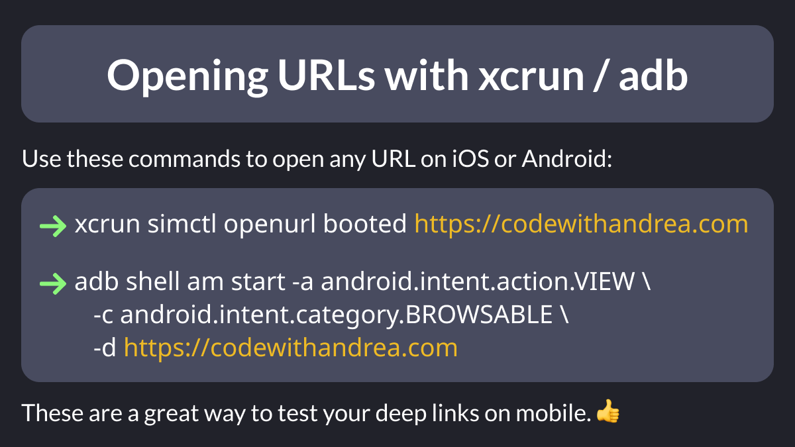

# Opening URLs with xcrun / adb

Did you know?

You can use xcrun and adb to open any URL on iOS / Android.

This is the easiest way to test your deep-linking implementation on mobile. 👍

Just pop open your iOS simulator / Android emulator and give them a go. ✨

---

### Found this useful? Show some love and share the [original tweet](https://twitter.com/biz84/status/1732369744399835344) 🙏

---

| Previous | Next |
| -------- | ---- |
| [Combining Streams with RxDart](../0137-rxdart-combine-latest/index.md) |  |

