# GitHub Copilot Tips for Flutter Devs

Did you know?

GitHub Copilot was recently updated to GPT-4.

The VSCode extension has been upgraded too, making your life easier as a Flutter dev.

But how good is it? And where does it fall short?

Here's a tour of the new Copilot AI features. 🧵

<!-- ALT
GitHub Copilot Tips for Flutter Devs
✨ Chat Panel + Inline Mode ✨
✅ Ask @workspace questions
✅ Explain code
✅ Write tests
❌ Fix code (unreliable)
✅ Add or edit code
✅ Resolve @terminal errors
📣 VSCode Speech extension
✅ Generate commit messages
-->

---

### GitHub Copilot: Chat Panel

The chat panel is a new feature that lets you have a dialogue with Copilot, just like with ChatGPT.

Add the `@workspace` keyword to your prompt, and Copilot will use the entire project as context when answering your questions.

Quite useful when exploring a new codebase. 👍

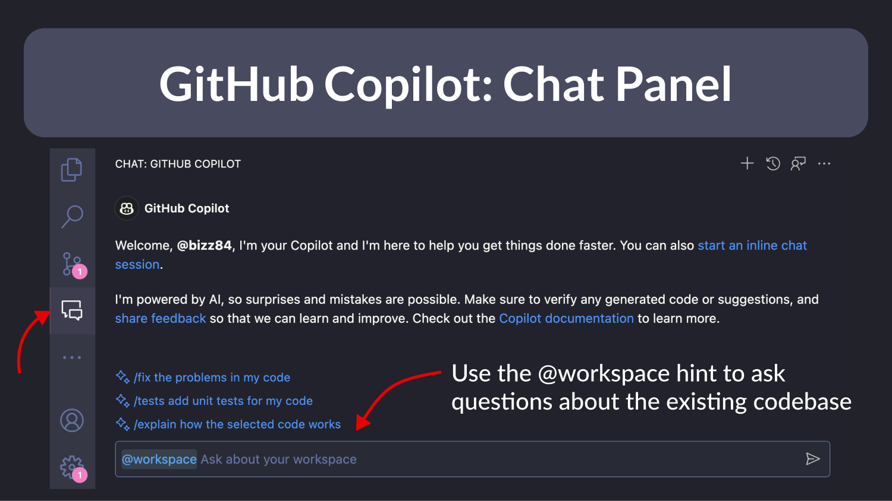

<!-- ALT
A preview of the Copilot chat panel in VSCode.

Shows how to use the @workspace hint to ask questions about the existing codebase
-->

---

### Ask questions with @workspace

To test this, I opened a Flutter e-commerce app and asked Copilot where is the product reviews feature.

In the answer, Copilot told me which files to look at.

Quite handy when exploring a new codebase. 👍

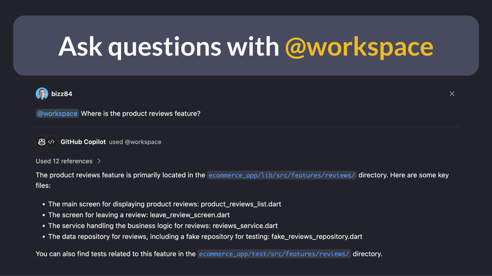

<!-- ALT
@workspace Where is the product reviews feature?

### **GitHub Copilot**

used @workspace

Used 12 references

The product reviews feature is primarily located in the `ecommerce_app/lib/src/features/reviews/` directory. Here are some key files:

- The main screen for displaying product reviews: product_reviews_list.dart
- The screen for leaving a review: leave_review_screen.dart
- The service handling the business logic for reviews: reviews_service.dart
- The data repository for reviews, including a fake repository for testing: fake_reviews_repository.dart

You can also find tests related to this feature in the `ecommerce_app/test/src/features/reviews/` directory.
-->

---

### @workspace /explain selected code

Another helpful feature is /explain.

Just select some code in the editor, then enter `/explain` in the prompt.

After explaining the code, Copilot even gives you a suggestion for the next prompt, so you can iteratively learn about the codebase.

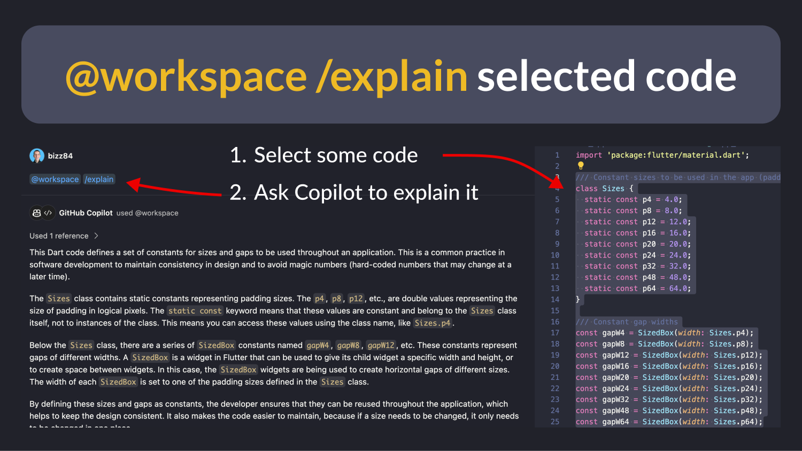

<!-- ALT
@workspace /explain

### **GitHub Copilot**

used @workspace

Used 1 reference

This Dart code defines a set of constants for sizes and gaps to be used throughout an application. This is a common practice in software development to maintain consistency in design and to avoid magic numbers (hard-coded numbers that may change at a later time).

The `Sizes` class contains static constants representing padding sizes. The `p4`, `p8`, `p12`, etc., are double values representing the size of padding in logical pixels. The `static const` keyword means that these values are constant and belong to the `Sizes` class itself, not to instances of the class. This means you can access these values using the class name, like `Sizes.p4`.

Below the `Sizes` class, there are a series of `SizedBox` constants named `gapW4`, `gapW8`, `gapW12`, etc. These constants represent gaps of different widths. A `SizedBox` is a widget in Flutter that can be used to give its child widget a specific width and height, or to create space between widgets. In this case, the `SizedBox` widgets are being used to create horizontal gaps of different sizes. The width of each `SizedBox` is set to one of the padding sizes defined in the `Sizes` class.

By defining these sizes and gaps as constants, the developer ensures that they can be reused throughout the application, which helps to keep the design consistent. It also makes the code easier to maintain, because if a size needs to be changed, it only needs to be changed in one place.

-->

---

### Write /tests for existing code

Next up: writing tests!

You can open any file in your project and ask Copilot to write tests for it.

In this example, it generated widget tests for my AsyncValueWidget helper class.

But are the tests any good?

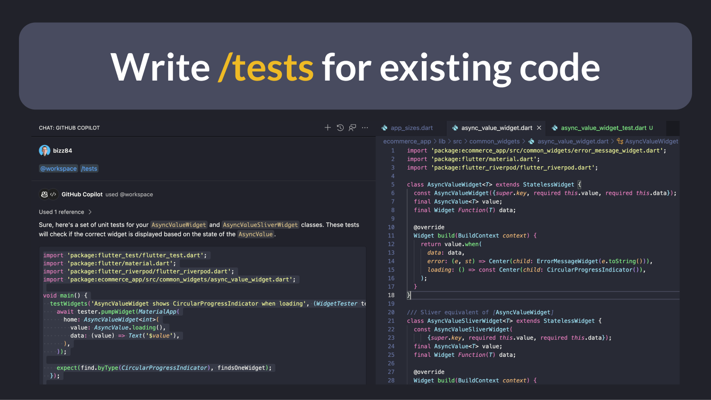

<!-- ALT
Output from Copilot when asked to write tests for an AsyncValueWidget class:

import 'package:flutter_test/flutter_test.dart';
import 'package:flutter/material.dart';
import 'package:flutter_riverpod/flutter_riverpod.dart';
import 'package:ecommerce_app/src/common_widgets/async_value_widget.dart';

void main() {
  testWidgets('AsyncValueWidget shows CircularProgressIndicator when loading', (WidgetTester tester) async {
    await tester.pumpWidget(MaterialApp(
      home: AsyncValueWidget<int>(
        value: AsyncValue.loading(),
        data: (value) => Text('$value'),
      ),
    ));

    expect(find.byType(CircularProgressIndicator), findsOneWidget);
  });

  testWidgets('AsyncValueWidget shows Text widget when data is present', (WidgetTester tester) async {
    await tester.pumpWidget(MaterialApp(
      home: AsyncValueWidget<int>(
        value: AsyncValue.data(10),
        data: (value) => Text('$value'),
      ),
    ));

    expect(find.text('10'), findsOneWidget);
  });
...
-->

---

### Write Tests: Output

In my example, Copilot generated 6 test cases covering all the various use cases.

So, code coverage was good. ✅

However, the generated code has a couple of compile errors. 👇

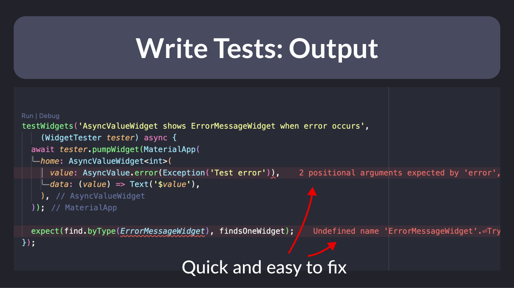

<!--

The tests output contains two compile errors

  testWidgets('AsyncValueWidget shows ErrorMessageWidget when error occurs', (WidgetTester tester) async {
    await tester.pumpWidget(MaterialApp(
      home: AsyncValueWidget<int>(
        value: AsyncValue.error(Exception('Test error')),
        data: (value) => Text('$value'),
      ),
    ));

    expect(find.byType(ErrorMessageWidget), findsOneWidget);
  });
-->

---

### Fixed Tests (After Minor Tweaks ⏱️)

The errors were so simple that I fixed them in 10 seconds (no kidding!) 💪

And it would have taken me much longer to write the tests by hand (without Copilot).

I still need to test this feature with more complex scenarios, but so far, I'm impressed!

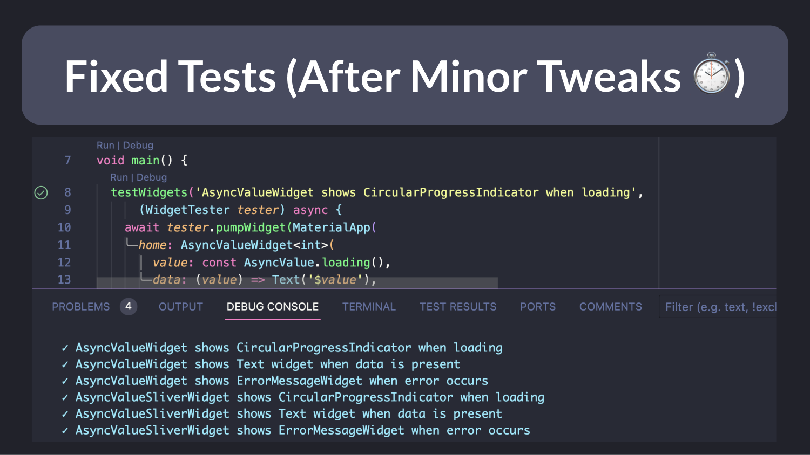

<!-- ALT

Here's how I fixed the test code generated by Copilot:

  testWidgets('AsyncValueWidget shows ErrorMessageWidget when error occurs',
      (WidgetTester tester) async {
    await tester.pumpWidget(MaterialApp(
      home: AsyncValueWidget<int>(
        value: AsyncValue.error(Exception('Test error'), StackTrace.current),
        data: (value) => Text('$value'),
      ),
    ));

    expect(find.byType(ErrorMessageWidget), findsOneWidget);
  });

After this fix, all six tests passed.
-->

---

### Inline Chat: Add New Code

Next Up: Inline Chat

From the editor, you can hit CMD+I to open the inline chat and ask Copilot to write some code.

This time, Copilot managed to add a simple method to a class, based on the surrounding code.

But other times, the output was incorrect and required some tweaks.

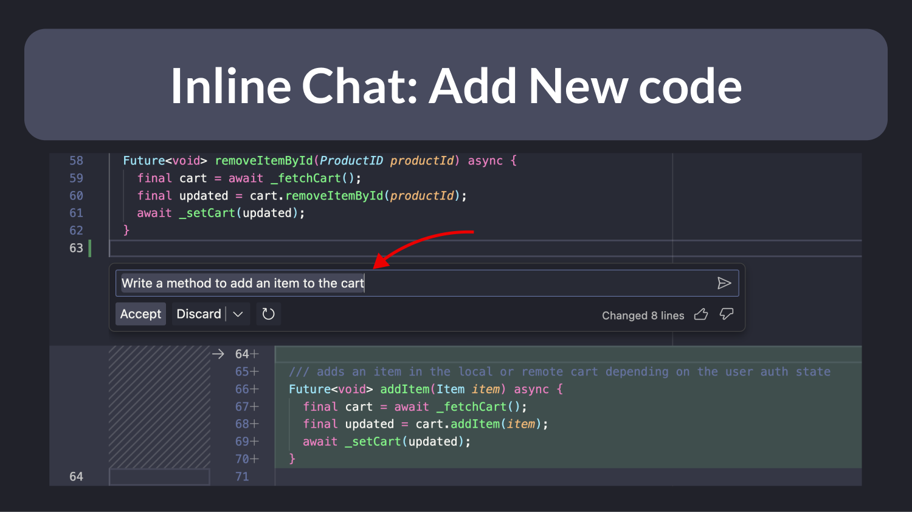

<!--
Inline Chat: Add New Code

From the editor, you can hit CMD+I to open the inline chat and ask Copilot to write some code.

This time, Copilot managed to add a simple method to a class, based on the surrounding code.

But other times, the output was incorrect and required some tweaks.
-->

---

### Inline Chat: Edit Existing Code

Copilot can edit existing code, too.

When asked to modify a button callback to add some conditional logic, Copilot showed a side-by-side code diff.

And in this particular task, it did well!

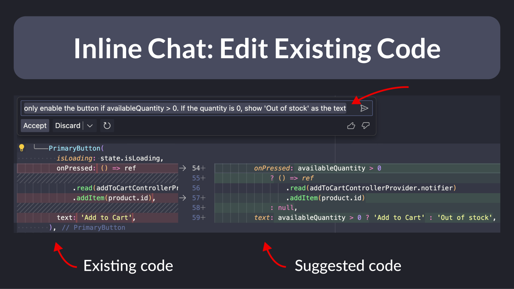

<!-- ALT

Another example where I asked Copilot to edit a button with this prompt:

only enable the button if availableQuantity > 0. If the quantity is 0, show ‘Out of stock’ as the text

The output was correct.
-->

---

### Fix using Copilot

Quick Fix is a well-known IDE assist for fixing issues with your code, and we now have an additional "Fix with Copilot" option.

I used it to fix a switch statement with a missing case, but Copilot failed to produce valid code.

So, for now, I'll stick with the old IDE assist.

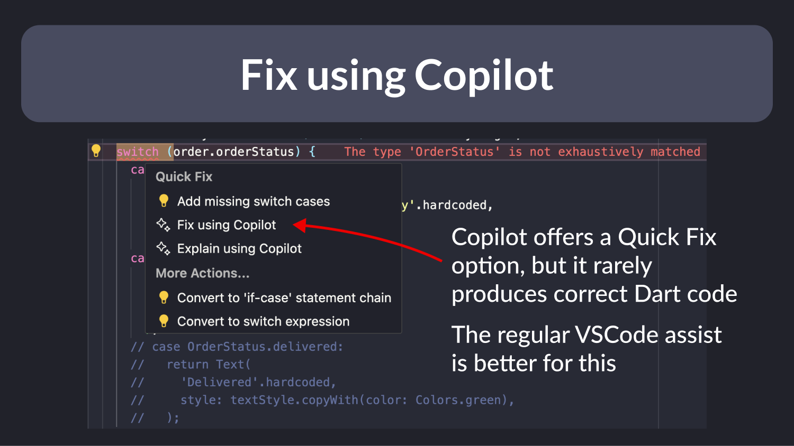

<!-- ALT
Quick Fix is a well-known IDE assist for fixing issues with your code, and we now have an additional "Fix with Copilot" option.

I used it to fix a switch statement with a missing case, but Copilot failed to produce valid code.

So, for now, I'll stick with the old IDE assist.
-->

---

### Resolve @terminal errors

Ever got stuck with the dreaded "version solving failed" error when updating an old Flutter project?

In this case, the Flutter CLI already suggested which dependency to update, but I missed it. 😅

But what's cool is that when a command fails, a ✨ icon will be waiting for you.

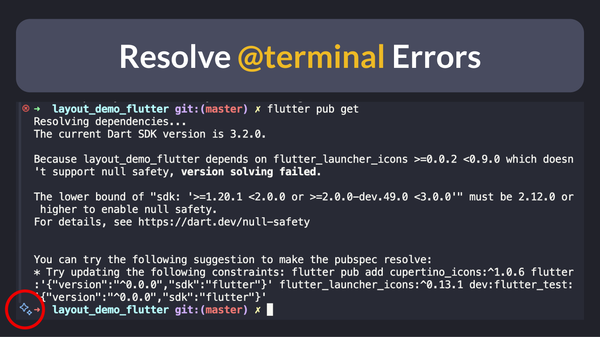

<!-- ALT

When a command fails, Copilot will show a ✨ icon, such as in this example:

Resolving dependencies...
The current Dart SDK version is 3.2.0.

Because layout_demo_flutter depends on flutter_launcher_icons >=0.0.2 <0.9.0 which doesn't support null safety, version solving failed.

The lower bound of "sdk: '>=1.20.1 <2.0.0 or >=2.0.0-dev.49.0 <3.0.0'" must be 2.12.0 or higher to enable null safety.
For details, see https://dart.dev/null-safety

You can try the following suggestion to make the pubspec resolve:

- Try updating the following constraints: flutter pub add cupertino_icons:^1.0.6 flutter:'{"version":"^0.0.0","sdk":"flutter"}' flutter_launcher_icons:^0.13.1 dev:flutter_test:'{"version":"^0.0.0","sdk":"flutter"}'

-->

---

### Resolve @terminal errors: Suggestion

Once the ✨ is clicked, the Copilot chat pops up with a suggestion to fix the problem.

In this case, the answer was the same as what the Flutter CLI had suggested (just more chatty).

But other times, you may get cryptic error messages, and this feature could be a lifesaver!

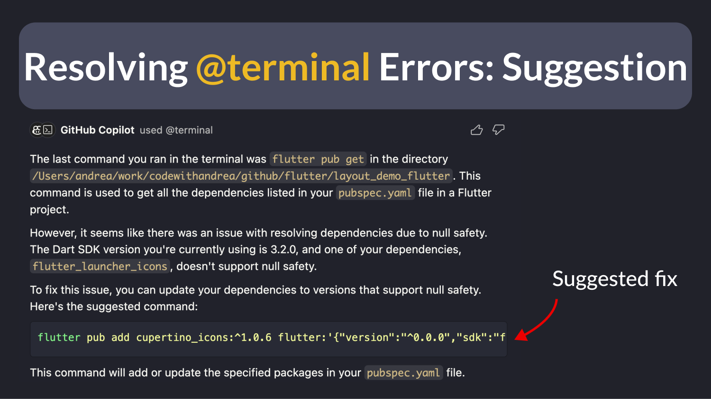

<!--

bizz84
@terminal #terminalLastCommand

GitHub Copilot
used @terminal
It seems like there's a version conflict with the cupertino_icons package in your Flutter project. The version you're trying to use (^0.0.6) doesn't match any available versions.

You can resolve this issue by upgrading the cupertino_icons package to a newer version. Here's how you can do it:

flutter pub add cupertino_icons:^1.0.6

This command will add the cupertino_icons package with version ^1.0.6 to your pubspec.yaml file and resolve the dependencies.
-->

---

### Generate Commit Message

If you pay attention, you'll see the ✨ icon appearing in many different places.

One of them is in the source control tab, where Copilot can generate a commit message for your changes.

Handy!

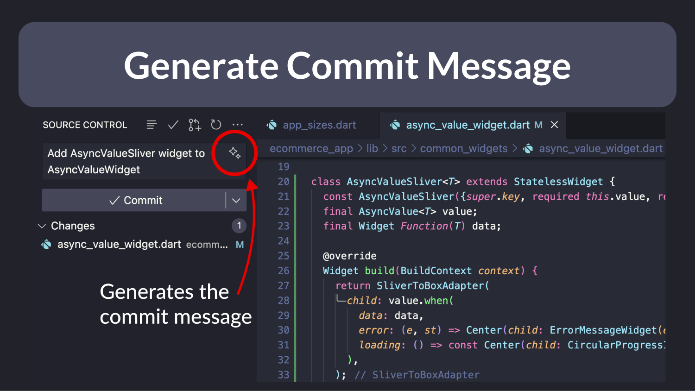

<!-- ALT

After making changes to our code, we want to commit them to source control.

And by using the ✨ icon, Copilot can generate the commit message for us.

-->

---

### What else can Copilot do?

Just hit SHIFT+CMD+P and enter "copilot" in the command palette to reveal all the options.

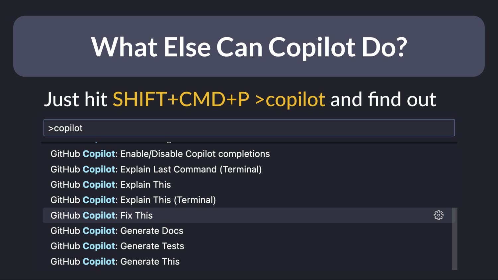

<!-- ALT
By opening the command palette and entering "copilot", you'll get a list of options showing what Copilot can do.
-->

---

So, what's my opinion of the updated Copilot?

As an AI assistant, it has improved a lot compared to two years ago.

If you want to write tests or documentation, it can save you a lot of time.

---

Sometimes, I already know what code I want to write.

And when that's the case, I'd rather write the code myself than play ball with Copilot and correct its mistakes.

With that said, I see myself using it more and more, and I can't wait to see how it will evolve.

---

BONUS: You can install the VS Code Speech extension to talk to Copilot and tell it what to do.

Here's a video of me using it (sound on!):

- [Asking GitHub Copilot to generate Square and Circle subclasses from a Shape class](https://customer-cj9d17w2zbobjd7j.cloudflarestream.com/abf770880a35d26714d702ac7f2deab1/watch)

---

Here's another attempt, where I asked Copilot to create a sliver version of a pre-existing widget class.

Though, as I'm not a native English speaker, Copilot often gets my words wrong and messes up the result. 😅

Still, speech-to-text is a great addition for accessibility.

- [Asking GitHub Copilot to generate a sliver version of an AsyncValueWidget class](https://customer-cj9d17w2zbobjd7j.cloudflarestream.com/c57ffe374c898cfb66ce08f207b1e648/watch)

---

### Found this useful? Show some love and share the [original tweet](https://twitter.com/biz84/status/1735680283767136686) 🙏

---

| Previous | Next |
| -------- | ---- |
| [Opening URLs with xcrun / adb](../0138-xcrun-adb-open-url/index.md) |  |

