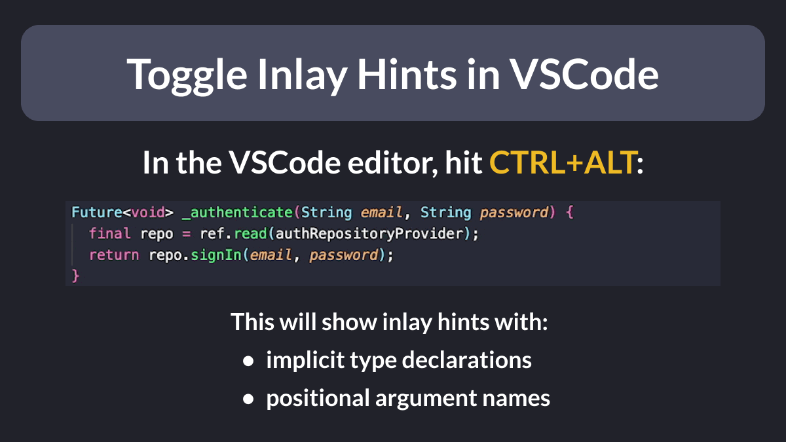

# Toggle Inlay Hints in VSCode

Did you know?

In VSCode, you can hit CTRL+ALT to show:
- all the implicit type declarations
- all the positional argument names

Super handy if you want to see all the types inferred by the compiler! 🔥

---

For more info on how to configure this, see this thread:

- [How can I toggle inlay hints in VS Code?](https://stackoverflow.com/questions/68698269/how-can-i-toggle-inlay-hints-in-vs-code)

---

### Found this useful? Show some love and share the [original tweet](https://twitter.com/biz84/status/1745778839249203498) 🙏

---

| Previous | Next |
| -------- | ---- |
| [GitHub Copilot Tips for Flutter Devs](../0139-github-copilot-tips-flutter-devs/index.md) | [⚠️ debugPrint prints in release mode ⚠️](../0141-dont-use-debug-print/index.md) |

