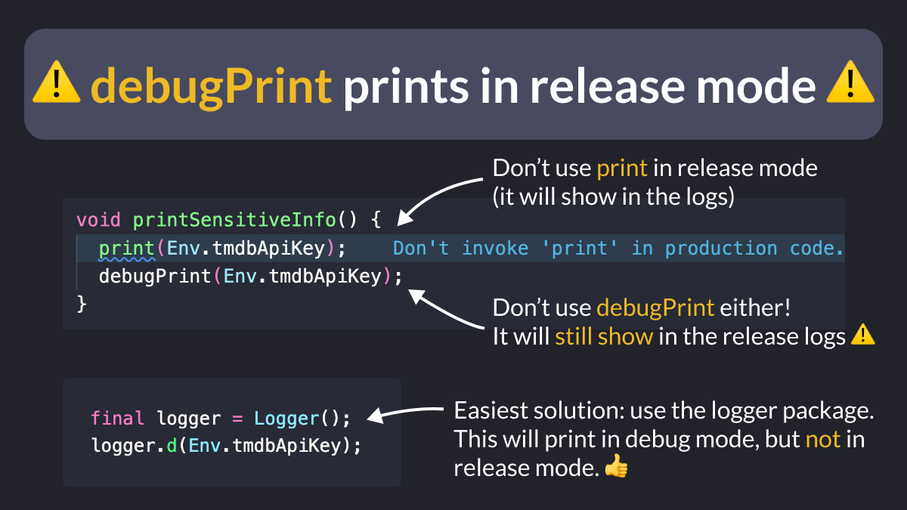

# ⚠️ debugPrint prints in release mode ⚠️

Did you know?

`debugPrint` prints logs in debug AND release mode, so be very careful when you use it!

Instead, consider using the logger package, which works as expected and only prints in debug mode by default. 👇

Another alternative is to use the [log](https://api.flutter.dev/flutter/dart-developer/log.html) function from `dart:developer`.

---

### Found this useful? Show some love and share the [original tweet](https://twitter.com/biz84/status/1747254624317546852) 🙏

---

| Previous | Next |
| -------- | ---- |
| [Toggle Inlay Hints in VSCode](../0140-vscode-toggle-inlay-hints/index.md) | [Launching your Flutter app with flavors](../0142-flutter-run-flavor/index.md) |

<!-- TODO:UPDATE -->