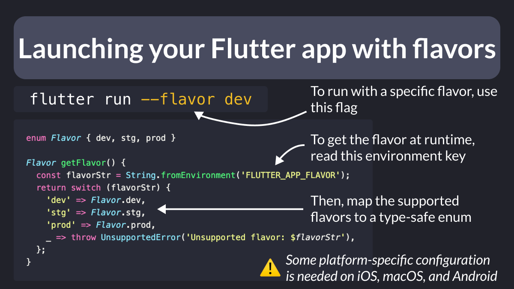

# Launching your Flutter app with flavors

Did you know?

When you run your Flutter app, you can add a `--flavor` argument.

To get the flavor at runtime, read the `FLUTTER_APP_FLAVOR` environment variable.

This will return a string that you can map to a type-safe enum.

---

Note that some platform-specific configuration is needed:

- on iOS and macOS, you need to set up some custom schemes and bundle IDs
- on Android, you need to add some `productFlavors` to the build.gradle file

Check this guide for all the details:

- [Create flavors of a Flutter app](https://docs.flutter.dev/deployment/flavors)

---

### Found this useful? Show some love and share the [original tweet](https://twitter.com/biz84/status/1750447557212242364) 🙏

---

| Previous | Next |
| -------- | ---- |
| [⚠️ debugPrint prints in release mode ⚠️](../0141-dont-use-debug-print/index.md) |  |
