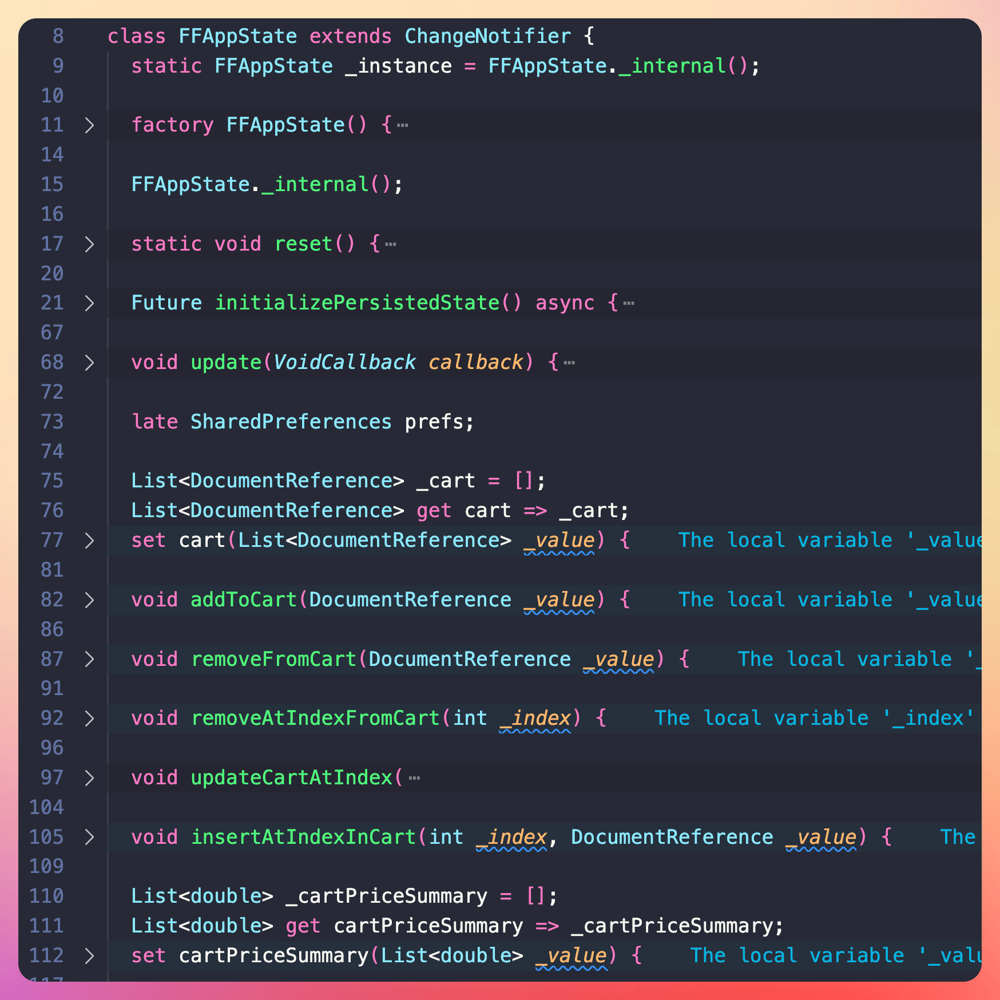

# We need to talk about FlutterFlow!

The company announced a $25.5M funding round, and there’s a big market for it.

So, is FlutterFlow the real deal? Or should you ignore it and continue building apps the old-fashioned way?

Over the last week, I’ve taken it for a ride and compiled a list of pros and cons:

### Pros

- Very good documentation and tutorials
- You can quickly build prototypes with it
- Firebase Integration is pretty good
- Drag & Drop UI is nice, and so is the theming support

### Cons

- Generated code is virtually unmaintainable (spaghetti code, god-like state class, linter rule violations, massive widgets, etc.)
- FlutterFlow decides everything on your behalf (dependencies, state management, routing, data persistence, etc.)
- You can’t **really** build production-ready apps
- The project history feature is a bare-bones version control system, not suitable for serious projects
- Poor debugging experience (you have to debug main.dart.js with the Chrome DevTools 😭)
- Once you download and edit the code in your IDE, you can’t sync it back to FlutterFlow
- Existing project templates are incomplete/not updated
- Other random errors and bugs

It kinda feels like a tool that gets you 80% or 90% of the way there (for simple apps, that is).

But once you get to the last 10%, you roll the dice and get three possible outcomes:

- phew, it works
- rewrite the whole app
- good luck fixing bugs and maintaining it

### Other Observations

- Drag & Drop UI is nice, but do you really need it when you already have excellent hot reload support in Flutter?
- The time it takes to learn the FlutterFlow UI would be better spent learning the Flutter widget library.
- For many apps, building the UI is not the hard part. There’s so much more that goes into building complex apps, and FlutterFlow is not the right tool for that.

### Summary

If you’re serious about building apps, this is my honest advice:

- If you know how to code, write code and don’t use FlutterFlow.
- If you don’t know how to code, learn how to code, and still don’t use FlutterFlow.

As they say, one image is worth more than 1000 words, so I’ll leave with this screenshot of a typical `FFAppState` class generated by FlutterFlow:

---

### Found this useful? Show some love and share the [original tweet](https://twitter.com/biz84/status/1752695079675056147) 🙏

---

| Previous | Next |
| -------- | ---- |
| [Launching your Flutter app with flavors](../0142-flutter-run-flavor/index.md) | [Scheduling microtasks in Dart](../0144-scheduling-microtasks/index.md) |
