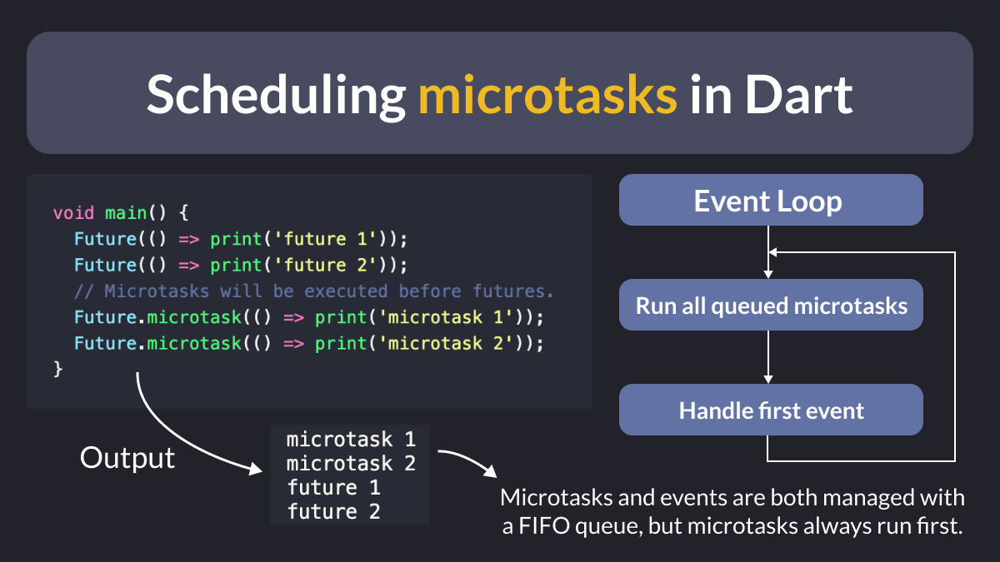

# Scheduling microtasks in Dart

Did you know?

In Dart, you can schedule a microtask when you want to complete a small async computation as soon as possible.

This will cause it to execute **before** any pending events in the event loop.

---

For more info about microtasks, events, event loops, and isolates, read this article:

- [Asynchrony Primer for Dart and Flutter](https://dart.academy/asynchrony-primer-for-dart-and-flutter/)

---

### Found this useful? Show some love and share the [original tweet](https://twitter.com/biz84/status/1752695079675056147) 🙏

---

| Previous | Next |
| -------- | ---- |
| [We need to talk about FlutterFlow!](../0143-we-need-to-talk-about-flutterflow/index.md) |  |
