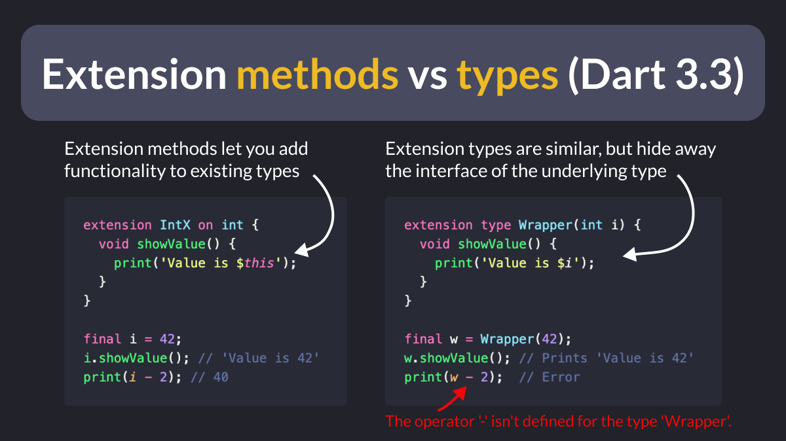

# Extension methods vs types (Dart 3.3)

Dart 3.3 introduces a new feature called Extension Types.

Extension types are quite similar to extension methods.

But the key difference is that extension *types* hide away the interface of the underlying type. 👇

---

Here's what the official docs say:

> An extension type is a compile-time abstraction that "wraps" an existing type with a different, static-only interface.

This is particularly useful for interoperability with host platforms.

Read on to learn more:

- [Extension types](https://dart.dev/language/extension-types)

---

### Found this useful? Show some love and share the [original tweet](https://twitter.com/biz84/status/1758507290921935252) 🙏

---

| Previous | Next |
| -------- | ---- |
| [Top tip for Flutter developers: write reusable widgets!](../0145-build-reusable-widgets/index.md) | [How to bundle assets based on flavor](../0147-bundle-assets-based-on-flavor/index.md) |

