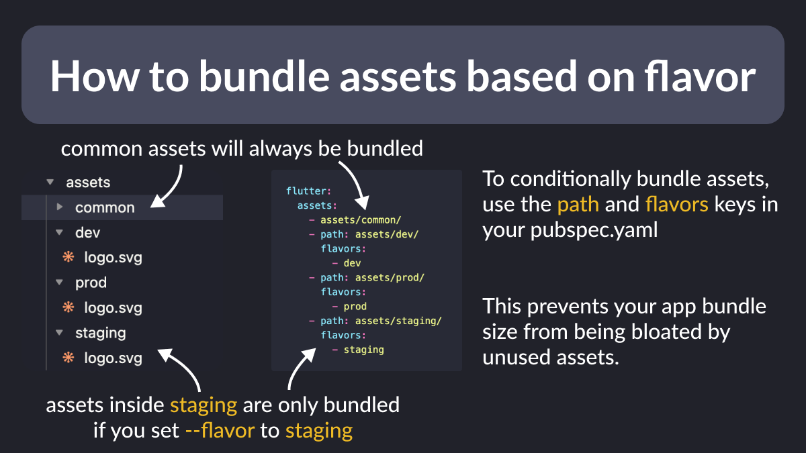

# How to bundle assets based on flavor

Did you know?

If you have assets that are only used in a specific flavor in your app, you can *conditionally* bundle them using the "path" and "flavors" options in your pubspec.yaml file.

This prevents your app bundle size from being bloated by unused assets.

---

For more details on how to do this, read the official docs:

- [Conditionally bundling assets based on flavor](https://docs.flutter.dev/deployment/flavors#conditionally-bundling-assets-based-on-flavor)

---

### Found this useful? Show some love and share the [original tweet](https://twitter.com/biz84/status/1760677176339509733) 🙏

---

| Previous | Next |
| -------- | ---- |
| [Extension methods vs types (Dart 3.3)](../0146-extension-types-dart3.3/index.md) | [Determinate Circular Progress Indicator](../0148-determinate-circular-progress-indicator/index.md) |

