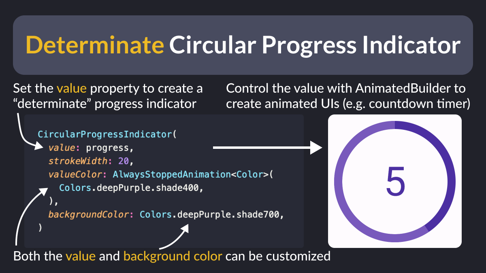

# Determinate Circular Progress Indicator

Did you know?

`CircularProgressIndicator` has two modes: "indeterminate" and "determinate".

To use the determinate mode, set a value in the [0, 1] range and customize the style as needed.

Then, control the value with `AnimatedBuilder` to create an animated countdown timer. ✨

---

### Found this useful? Show some love and share the [original tweet](https://twitter.com/biz84/status/1762836485517046142) 🙏

---

| Previous | Next |
| -------- | ---- |
| [How to bundle assets based on flavor](../0147-bundle-assets-based-on-flavor/index.md) |  |

