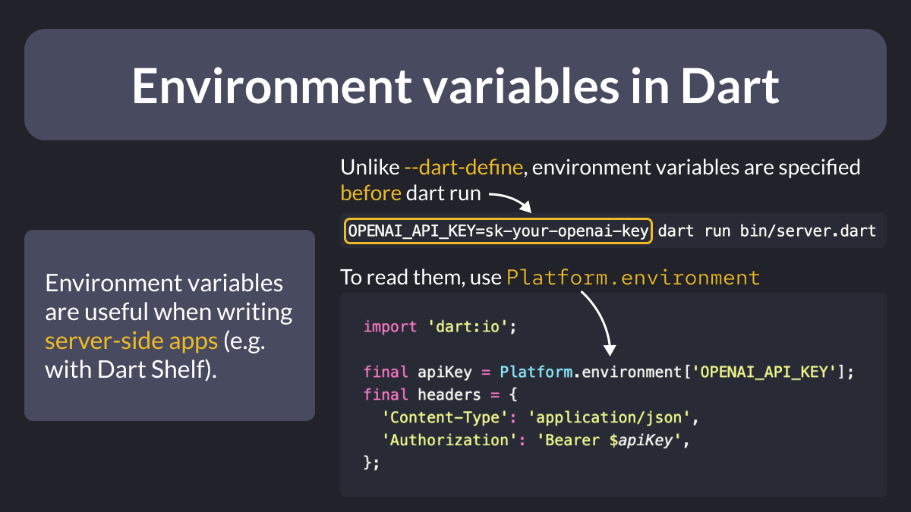
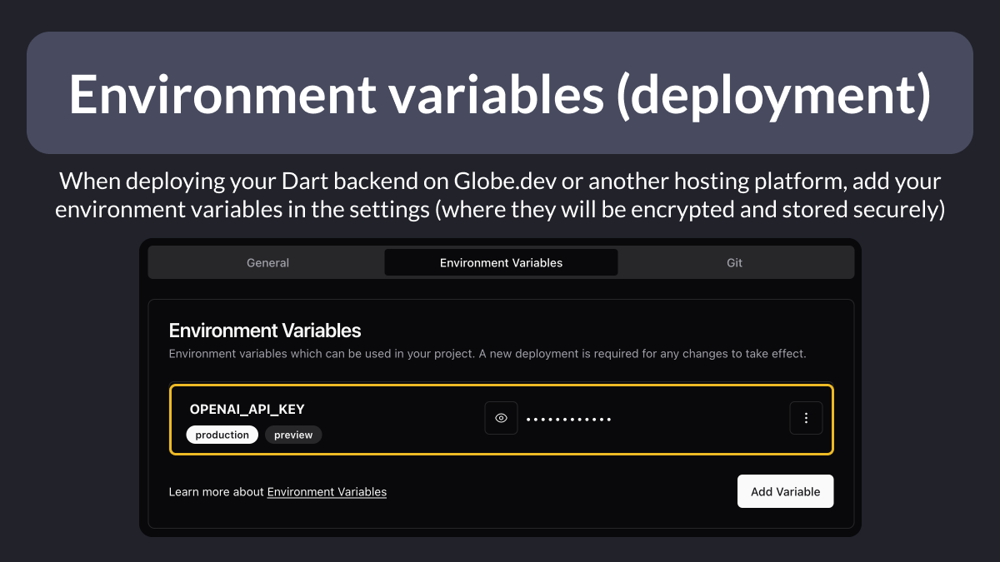

# Environment variables in Dart

Did you know?

As an alternative to `--dart-define` flags, you can define environment variables in Dart.

These are useful when writing **server-side** apps with Dart Shelf or Dart Frog.

See below for how to configure them on the server. 🧵

<!--
When running a server-side Dart app, you can specify environment variables like this:

OPENAI_API_KEY=sk-your-openai-key dart run bin/server.dart

Then, you can read them like this in your code

import 'dart:io';

final apiKey = Platform.environment['OPENAI_API_KEY'];
final headers = {
  'Content-Type': 'application/json',
  'Authorization': 'Bearer $apiKey',
};
-->

---

When you deploy your server-side app, you can set the environment variables in the settings.

This way, they can be read and used correctly when your server processes incoming requests from your Flutter client.

<!--
When deploying your Dart backend on Globe.dev or another hosting platform, add your environment variables in the settings (where they will be encrypted and stored securely)
-->

---

### Found this useful? Show some love and share the [original tweet](https://twitter.com/biz84/status/1765699988137312445) 🙏

---

| Previous | Next |
| -------- | ---- |
| [Determinate Circular Progress Indicator](../0148-determinate-circular-progress-indicator/index.md) |  |

