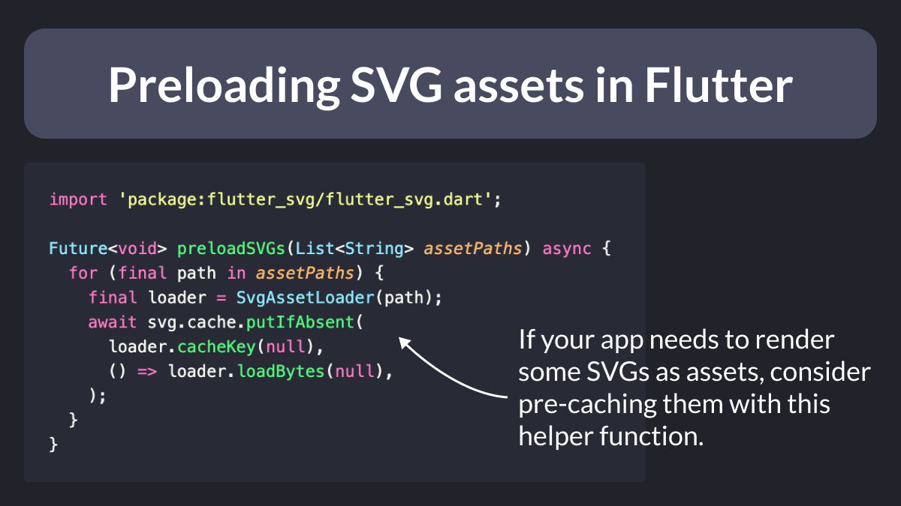
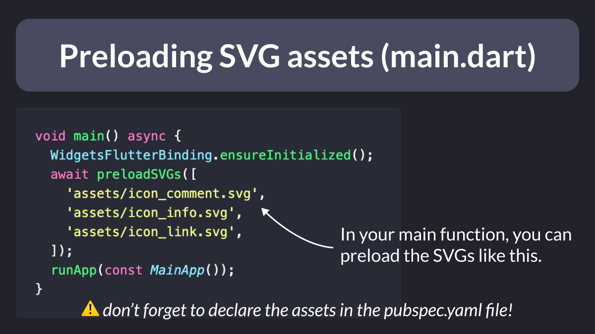
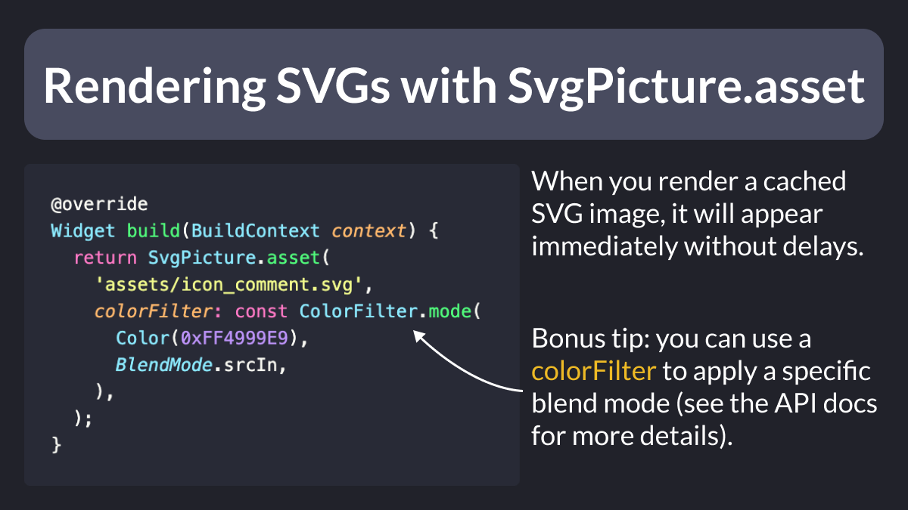

# Preloading SVG assets in Flutter

SVGs have some advantages over regular images:

- scalable without loss of quality
- smaller and more performant (for simple shapes)

But have you noticed that when you use SVGs in your apps, they don't always appear immediately?

To fix this, consider pre-caching them: 👇

<!--
// Preloading SVG assets in Flutter
import 'package:flutter_svg/flutter_svg.dart';

Future<void> preloadSVGs(List<String> assetPaths) async {
  for (final path in assetPaths) {
    final loader = SvgAssetLoader(path);
    await svg.cache.putIfAbsent(
      loader.cacheKey(null),
      () => loader.loadBytes(null),
    );
  }
}
-->

---

Once the `preloadSVGs` function is defined, simply call it inside your `main()`.

Oh, and don't forget to add the assets and declare them in your `pubspec.yaml` file. 😉

<!--
// Preloading SVG assets (main.dart)
void main() async {
  WidgetsFlutterBinding.ensureInitialized();
  await preloadSVGs([
    'assets/icon_comment.svg',
    'assets/icon_info.svg',
    'assets/icon_link.svg',
  ]);
  runApp(const MainApp());
}
-->

---

Then, you can render your SVGs inside your widgets as needed.

And since they have been cached, they will be rendered immediately.

**Bonus**: you can use the `colorFilter` property to apply a specific blend mode (see the API docs for details).

<!--
// Rendering SVGs with SvgPicture.asset
@override
Widget build(BuildContext context) {
  return SvgPicture.asset(
    'assets/icon_comment.svg',
    colorFilter: const ColorFilter.mode(
      Color(0xFF4999E9),
      BlendMode.srcIn,
    ),
  );
}

-->

---

### Found this useful? Show some love and share the [original tweet](https://twitter.com/biz84/status/1767558469538758682) 

---

| Previous | Next |
| -------- | ---- |
| [Environment variables in Dart](../0149-environment-variables/index.md) |  |

