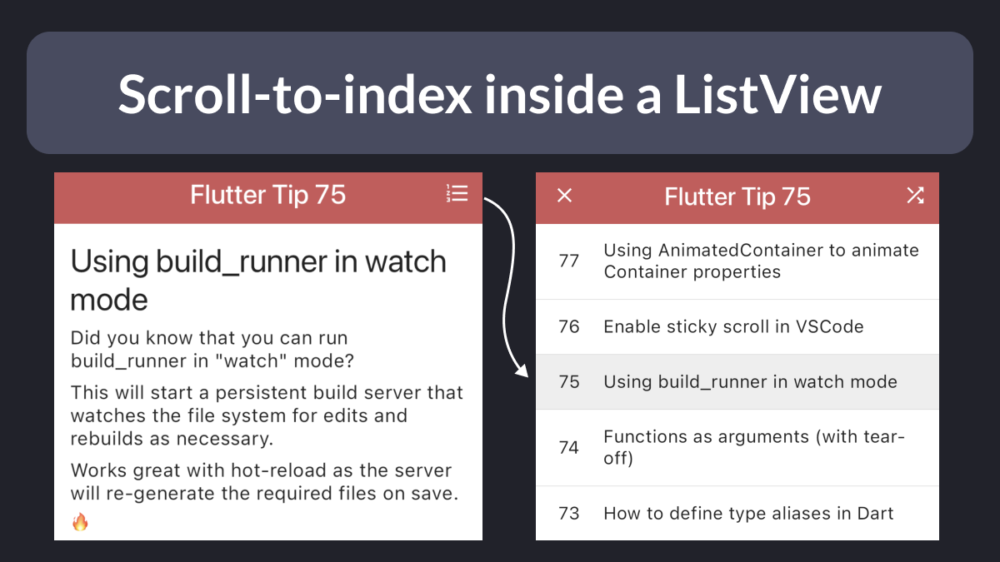
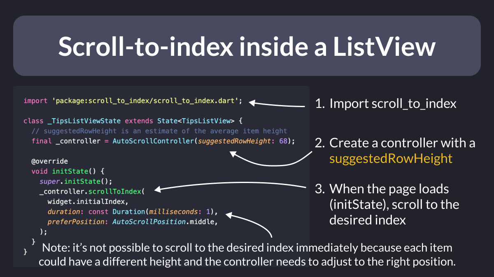
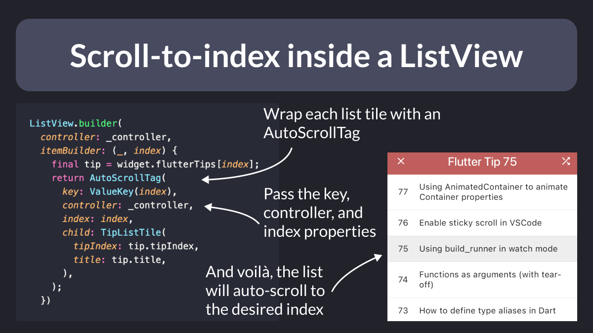

# Scroll-to-index inside a ListView

Ever needed to open a new page with a `ListView` and immediately scroll to a given item by index?

This is hard to do if all the items can have different heights.

Luckily, the `scroll_to_index` package can help.

<!--
Example of navigation to a destination page that contains a ListView, which requires scroll-to-index on load.
-->

---

To use it, declare an `AutoScrollController` inside your `State` class.

Then, inside `initState`, scroll to the desired index.

The controller will use the `suggestedRowHeight` to scroll to the approximate location, calculate the exact offset, and animate to it.

<!--
import 'package:scroll_to_index/scroll_to_index.dart';

class _TipsListViewState extends State<TipsListView> {
  // suggestedRowHeight is an estimate of the average item height
  final _controller = AutoScrollController(suggestedRowHeight: 68);

  @override
  void initState() {
    super.initState();
    _controller.scrollToIndex(
      widget.initialIndex,
      duration: const Duration(milliseconds: 1),
      preferPosition: AutoScrollPosition.middle,
    );
  }
}
-->

---

Finally, wrap your list tiles with an `AutoScrollTag`, passing the correct `key`, `controller`, and `index` values.

From now on, you can use the controller to scroll to any item by index. ✨

<!--
ListView.builder(
  controller: _controller,
  itemBuilder: (_, index) {
    final tip = widget.flutterTips[index];
    return AutoScrollTag(
      key: ValueKey(index),
      controller: _controller,
      index: index,
      child: TipListTile(
        tipIndex: tip.tipIndex,
        title: tip.title,
      ),
    );
  })
-->

---

### Found this useful? Show some love and share the [original tweet](https://twitter.com/biz84/status/1767916676098470071) 

---

| Previous | Next |
| -------- | ---- |
| [Preloading SVG assets in Flutter](../0150-preload-svgs/index.md) |  |

