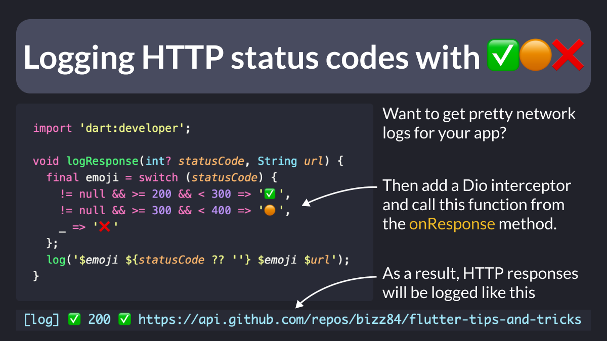

# Logging HTTP status codes with emojis

Want to get pretty network logs that look like this?

- ✅ 200 ✅ <URL>
- 🟠 308 🟠 <URL>
- ❌ 404 ❌ <URL>

With [Dio](https://pub.dev/packages/dio), this is super easy:
- add an interceptor and override the `onResponse` method
- call a helper function that maps HTTP status codes to emojis with a switch expression

<!--
// A simple helper function that maps http status codes to emojis and logs them to the console

import 'dart:developer';

void logResponse(int? statusCode, String url) {
  final emoji = switch (statusCode) {
    != null && >= 200 && < 300 => '✅',
    != null && >= 300 && < 400 => '🟠',
    _ => '❌'
  };
  log('$emoji ${statusCode ?? ''} $emoji $url');
}
-->

---

### Found this useful? Show some love and share the [original tweet](https://twitter.com/biz84/status/1768588707852902738) 

---

| Previous | Next |
| -------- | ---- |
| [Scroll-to-index inside a ListView](../0151-scroll-to-index/index.md) |  |

