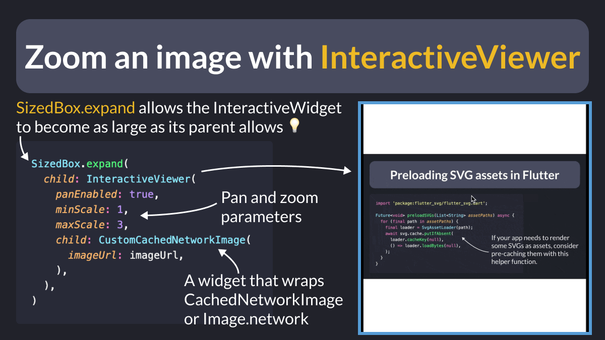

# Zoom an image with InteractiveViewer

Did you know?

You can use an `InteractiveViewer` widget to enable pan and pinch to zoom on any image. ✨

This is super handy and very useful on small screens (mobile).

---

You can set the `clipBehavior` property to `Clip.none` to let the image overflow the `InteractiveViewer`'s bounds when zooming, but this doesn't work as intended.

As a workaround, wrap the `InteractiveWidget` with `SizedBox.expand`. 👌

More info here 👇

- [InteractiveViewer gets stuck when zoomed in and unable to zoom out if used with Clip.none](https://github.com/flutter/flutter/issues/145426)

---

### Found this useful? Show some love and share the [original tweet](https://twitter.com/biz84/status/1771126164284735828) 

---

| Previous | Next |
| -------- | ---- |
| [Logging HTTP status codes with emojis](../0152-log-status-code-emoji/index.md) | [Loading UI with Shimmer effect](../0154-shimmer-effect/index.md) |

<!-- TWITTER|https://twitter.com/biz84/status/1771126164284735828 -->
<!-- LINKEDIN|https://www.linkedin.com/posts/andreabizzotto_did-you-know-you-can-use-an-interactiveviewer-activity-7176892015689768960-sXJh -->
