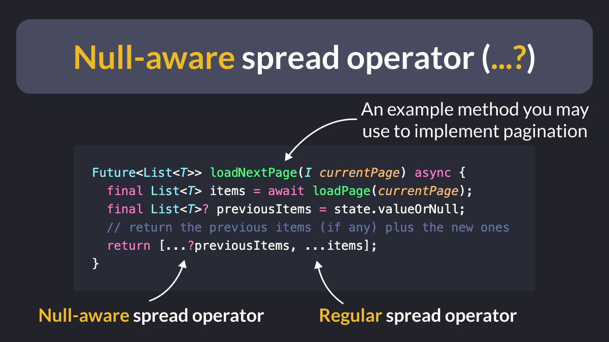

# Null-aware spread operator (...?)

Did you know?

In addition to the regular spread operator, Dart also has a **null-aware** variant.

This is useful if you want to produce a list of items by concatenating a collection that may be null (such as when implementing pagination). 👌

<!--
Future<List<T>> loadNextPage(I currentPage) async {
  final List<T> items = await loadPage(currentPage);
  final List<T>? previousItems = state.valueOrNull;
  // return the previous items (if any) plus the new ones
  return [...?previousItems, ...items];
}
-->

---

For more details, read the official documentation:

- [Spread operators](https://dart.dev/language/collections#spread-operators)

---

### Found this useful? Show some love and share the [original tweet](https://twitter.com/biz84/status/1775445897775558934) 

---

| Previous | Next |
| -------- | ---- |
| [Loading UI with Shimmer effect](../0154-shimmer-effect/index.md) |  |

<!-- TWITTER|https://twitter.com/biz84/status/1775445897775558934 -->
<!-- LINKEDIN|https://www.linkedin.com/posts/andreabizzotto_did-you-know-in-addition-to-the-regular-activity-7181211620457467904-N9l- -->