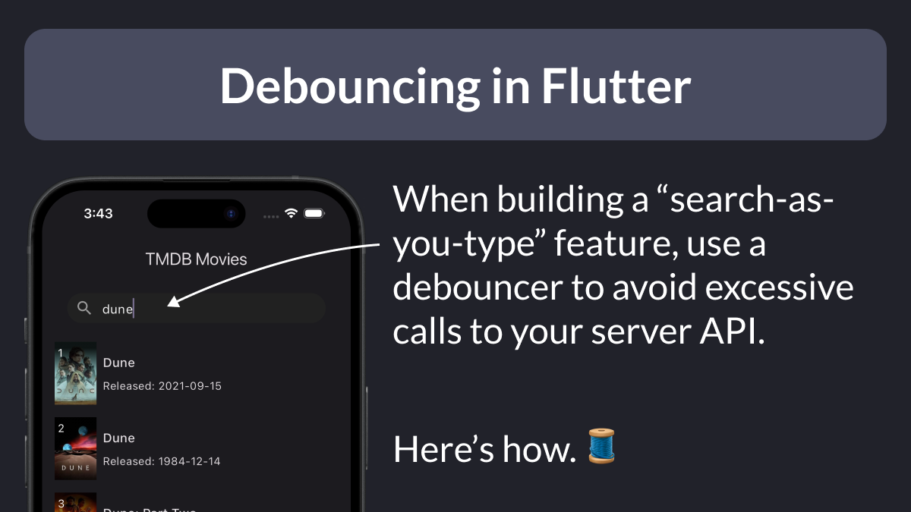
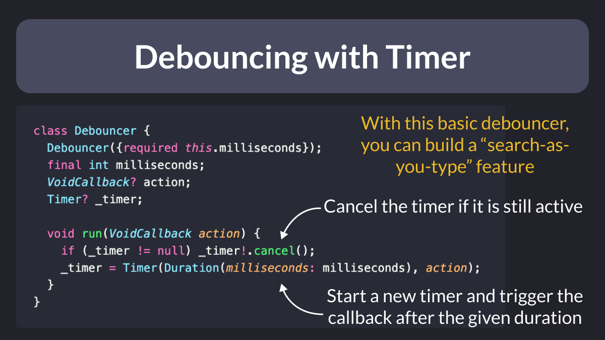
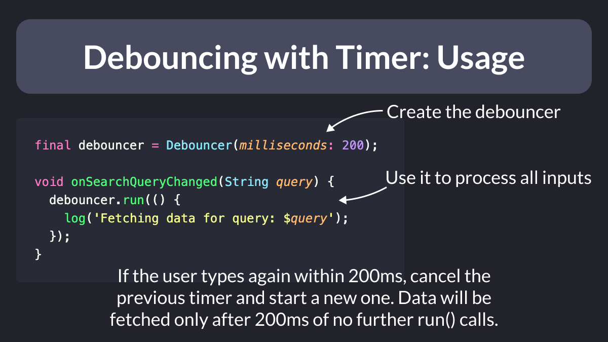
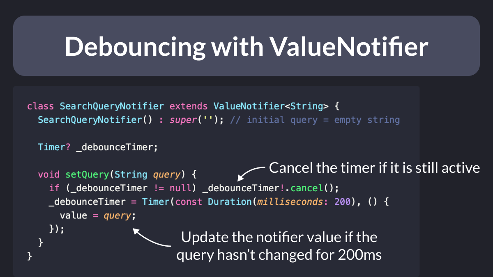
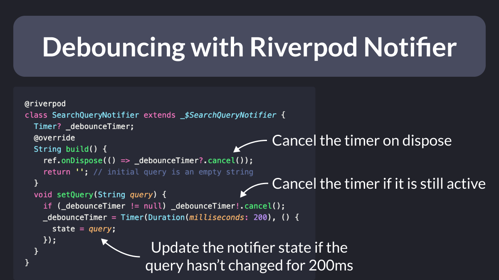
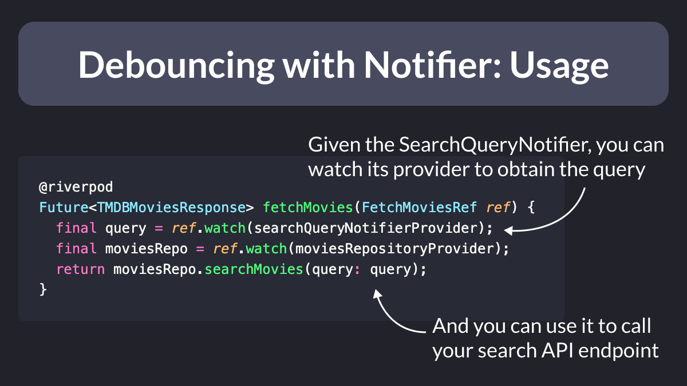
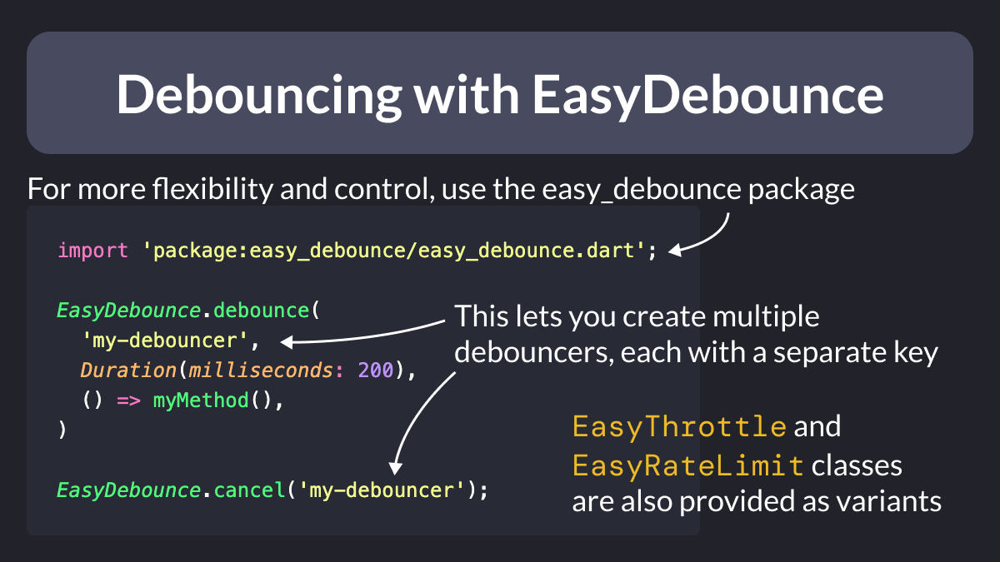

# Debouncing in Flutter

When building a "search-as-you-type" feature, you need to strike the right balance between two things:

- show the results quickly
- avoid excessive calls to the server API

This can be accomplished with a so-called **debouncer**.

Here's a thread showing how to implement this. 🧵

<!--
Debouncing in Flutter

When building a "search-as-you-type" feature, use a debouncer to avoid excessive calls to your server API.

Here's how. 🧵
-->

---

### Debouncing with Timer

The simplest debouncer you can build uses a simple `Timer`.

It works with a timer that triggers a callback, but only if a given duration has elapsed since the previous invocation. 👇

<!-- 
class Debouncer {
  Debouncer({required this.milliseconds});
  final int milliseconds;
  VoidCallback? action;
  Timer? _timer;

  void run(VoidCallback action) {
    if (_timer != null) _timer!.cancel();
    _timer = Timer(Duration(milliseconds: milliseconds), action);
  }
}
-->

---

### Debouncing with Timer: Usage

To use this debouncer, declare it inside a widget class.

Then, from a `TextField` `onChanged` callback, you can call a method that runs the debouncer.

<!--
final debouncer = Debouncer(milliseconds: 200);

void onSearchQueryChanged(String query) {
  debouncer.run(() {
    log('Fetching data for query: $query');
  });
}
-->

---

### Debouncing with ValueNotifier

A more flexible solution is to turn the debouncer into an **observable** class, such as a `ValueNotifier`.

This makes it easier to observe the debouncer with a `ValueListenableBuilder` that lives elsewhere in the widget tree.

<!--
class SearchQueryNotifier extends ValueNotifier<String> {
  SearchQueryNotifier() : super(''); // initial query = empty string

  Timer? _debounceTimer;

  void setQuery(String query) {
    if (_debounceTimer != null) _debounceTimer!.cancel();
    _debounceTimer = Timer(const Duration(milliseconds: 200), () {
      value = query;
    });

  }
}

class SearchListView extends StatelessWidget {
  const SearchListView({super.key, required this.searchQueryListenable});
  final ValueListenable searchQueryListenable;

  @override
  Widget build(BuildContext context) {
    return ValueListenableBuilder(
        valueListenable: searchQueryListenable,
        builder: (_, query, __) {
          // TODO: Fetch data with a FutureBuilder
          // and show results inside a ListView
        });
  }
}
-->

---

### Debouncing with Riverpod Notifier

Here's another example using Riverpod.

In this case, the debouncer is a `Notifier` subclass where:

- the `build` method returns the initial query (an empty string)
- the timer is created in the `setQuery` method
- the timer is cancelled as needed

<!--

@riverpod
class SearchQueryNotifier extends _$SearchQueryNotifier {
  Timer? _debounceTimer;
  @override
  String build() {
    ref.onDispose(() => _debounceTimer?.cancel());
    return ''; // initial query is an empty string
  }
  void setQuery(String query) {
    if (_debounceTimer != null) _debounceTimer!.cancel();
    _debounceTimer = Timer(Duration(milliseconds: 200), () {
      state = query;
    });
  }
}

-->

---

### Debouncing with Notifier: Usage

The advantage over the `ValueNotifier` implementation is that with Riverpod, we can listen to the notifier inside a separate provider.

This makes it easier to lift the fetching logic outside our widget code.

<!--

@riverpod
Future<TMDBMoviesResponse> fetchMovies(FetchMoviesRef ref) {
  final query = ref.watch(searchQueryNotifierProvider);
  final moviesRepo = ref.watch(moviesRepositoryProvider);
  return moviesRepo.searchMovies(query: query);
}
-->

---

### Debouncing with EasyDebounce

For more flexibility and control, you can use the easy_debounce package.

This allows you to create multiple debouncers indexed by key and offers three variants:

- `EasyDebounce`
- `EasyThrottle`
- `EasyRateLimit`

Check the [package README](https://pub.dev/packages/easy_debounce) for how to use them.

<!--

import 'package:easy_debounce/easy_debounce.dart';

EasyDebounce.debounce(
  'my-debouncer',
  Duration(milliseconds: 200),
  () => myMethod(),
)

EasyDebounce.cancel('my-debouncer');
-->

---

When building a search UX for your app, the debouncer is a small but important piece of the puzzle.

To learn about how to build a complete search feature with pagination, read this article: 👇

- [Flutter Pagination with Riverpod: The Ultimate Guide](https://codewithandrea.com/articles/flutter-riverpod-pagination/)

---

### Found this useful? Show some love and share the [original tweet](https://twitter.com/biz84/status/1779868484672823657) 

---

| Previous | Next |
| -------- | ---- |
| [Null-aware spread operator (...?)](../0155-null-aware-spread-operator/index.md) | [Force App Upgrade Gone Wrong 😭](../0157-force-upgrade-gone-wrong/index.md)  |

<!-- TWITTER|https://twitter.com/biz84/status/1779868484672823657 -->
<!-- LINKEDIN|https://www.linkedin.com/posts/andreabizzotto_when-building-a-search-as-you-type-feature-activity-7185638243126648833-EezS -->