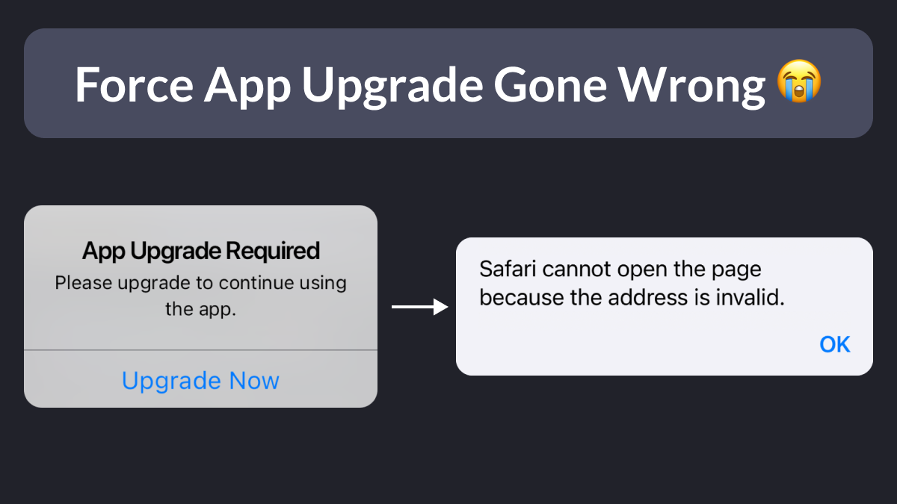

# Force App Upgrade Gone Wrong 😭

I messed up my force upgrade logic! 🤦‍♂️

In my latest app, the code below runs if the required app version (fetched from Firebase Remote Config) is greater than the current app version.

But I forgot to point to the correct download URLs! 😭

<!--
Future<void> _launchAppStore() async {
  // TODO: Replace these URLs with your app's URLs
  final urlAndroid = Uri.parse(
      'https://play.google.com/store/apps/details?id=com.example.myapp');
  final urlIOS = Uri.parse('https://apps.apple.com/us/app/myapp/id123456789');

  final url = Platform.isIOS ? urlIOS : urlAndroid;
  if (await canLaunchUrl(url)) {
    await launchUrl(url);
  } else {
    throw 'Could not launch $url';
  }
}
-->

---

Because of this mistake, if I bump the required app version in Firebase Remote Config, users running the old code will get an app upgrade prompt.

But once they click on it, they'll be redirected to the wrong App Store / Play Store URL.

<!--
When the force update logic is triggered, users will see this message:

App Upgrade Required. Please upgrade to continue using the app.

After clicking "Upgrade Now", they'll see this error message in the web browser:

Safari cannot open the page because the address is invalid.
-->

---

Lessons learned:

- Review all TODOs before launch
- Test the app upgrade prompt **before and after** publishing the app
- Hardcoded strings are dangerous (I could have stored the download URLs in Remote Config instead)

---

### Found this useful? Show some love and share the [original tweet](https://twitter.com/biz84/status/1780506401086865438) 

---

| Previous | Next |
| -------- | ---- |
| [Debouncing in Flutter](../0156-debouncing-timer/index.md) |  |

<!-- TWITTER|https://twitter.com/biz84/status/1780506401086865438 -->
<!-- LINKEDIN|https://www.linkedin.com/posts/andreabizzotto_i-messed-up-my-force-upgrade-logic-activity-7186272936855576576-gB42 -->
