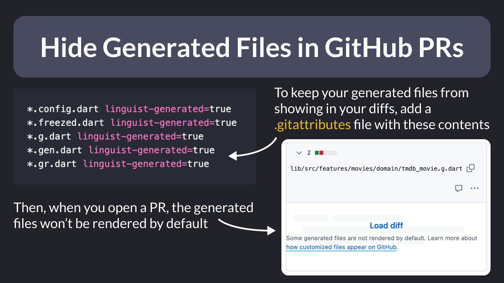

# Hide Generated Dart Files in GitHub PRs

Did you know?

If you use build_runner and your generated Dart files are added to Git, you can hide them by default in your PRs and diffs.

To do this, simply add them to a .gitattributes file at the root of the project. 👇

<!--
To keep your generated files from showing in your diffs, add a .gitattributes file with these contents:

*.config.dart linguist-generated=true
*.freezed.dart linguist-generated=true
*.g.dart linguist-generated=true
*.gen.dart linguist-generated=true
*.gr.dart linguist-generated=true

Then, when you open a PR, the generated files won’t be rendered by default.
-->

---

Here's what the official GitHub docs say about this:

- [Customizing how changed files appear on GitHub](https://docs.github.com/en/repositories/working-with-files/managing-files/customizing-how-changed-files-appear-on-github)

---

To learn more about code generation in Dart, read this ultimate guide on my site:

- [Code Generation with Dart & Flutter: The Ultimate Guide](https://codewithandrea.com/articles/dart-flutter-code-generation/)

---

### Found this useful? Show some love and share the [original tweet](https://twitter.com/biz84/status/1787840083954950434) 

---

| Previous | Next |
| -------- | ---- |
| [Force App Upgrade Gone Wrong](../0157-force-upgrade-gone-wrong/index.md) | [6 Steps to Become a 64x Programmer](../0159-6-steps-64x-programmer/index.md) |

<!-- TWITTER|https://twitter.com/biz84/status/1787840083954950434 -->
<!-- LINKEDIN|https://www.linkedin.com/posts/andreabizzotto_did-you-know-if-you-use-buildrunner-and-activity-7193605951357169666-igIf -->