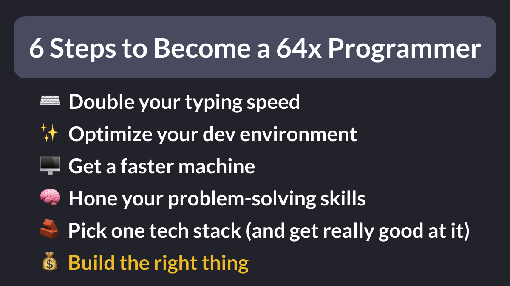
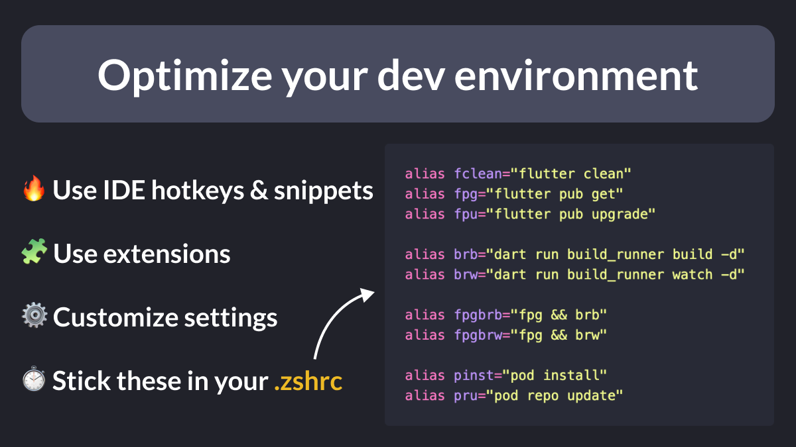
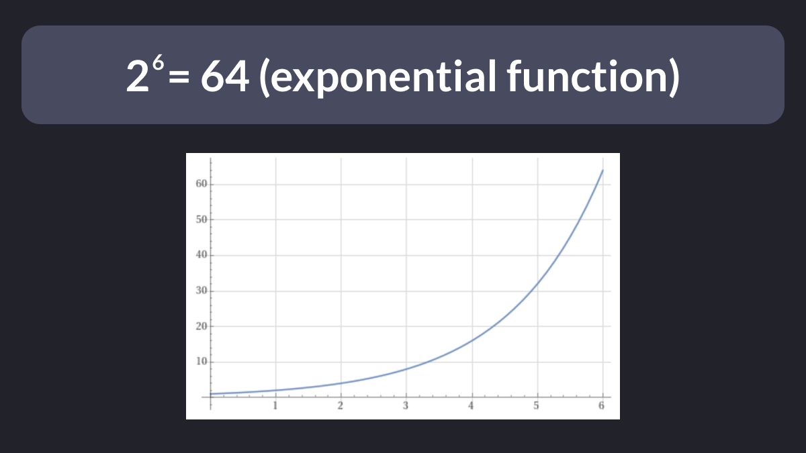

# 6 Steps to Become a 64x Programmer

6 steps to become a 64x programmer:

- Double your typing speed ⌨️
- Optimize your dev environment ✨
- Get a faster machine 🖥️
- Hone your problem-solving skills 🧠
- Pick one tech stack (and get really good at it) 🧱
- Build the right thing 💰

Let's break them down (hear me out). 🧵

<!--
6 steps to become a 64x programmer:

⌨️ Double your typing speed
✨ Optimize your dev environment
🖥️ Get a faster machine
🧠 Hone your problem-solving skills
🧱 Pick one tech stack (and get really good at it)
💰 Build the right thing
-->

---

First, one clarification: 64x is just a multiplier that doesn’t mean anything without context.

So, let's go with this working definition:

How can you become 64x better at delivering value for your users/business compared to what you’re doing now?

---

### 1. Double Your Typing Speed

I hear the sceptics already: “Coding is more about thinking than typing fast!”

I used to agree, but after reading this post by Dan Luu, I changed my mind. 👇

http://danluu.com/productivity-velocity/

---

### 2. Optimize your Dev Environment

- Use IDE hotkeys & snippets 🔥
- Use extensions 🧩
- Customize your IDE settings ⚙️
- Define aliases for repetitive commands ⏱️

<!--
Optimize your Dev Environment

🔥 Use IDE hotkeys & snippets
🧩 Use extensions
⚙️ Customize settings
⏱️ Stick these in your .zshrc

alias fclean="flutter clean"
alias fpg="flutter pub get"
alias fpu="flutter pub upgrade"

alias brb="dart run build_runner build -d"
alias brw="dart run build_runner watch -d"

alias fpgbrb="fpg && brb"
alias fpgbrw="fpg && brw"

alias pinst="pod install"
alias pru="pod repo update"
-->

See this article for more info: 👇

- [VSCode Shortcuts, Extensions & Settings for Flutter Development](https://codewithandrea.com/articles/vscode-shortcuts-extensions-settings-flutter-development/)

---

### 3. Get a Faster Machine

When I upgraded from my old Intel i5 iMac to a Mac Studio M2 Max, my reaction was: “Oh my God!”

Of course, not everyone can afford the best hardware, but the general sentiment is the same: get the fastest machine your money can buy.

---

### 4. Hone Your Problem-Solving Skills

When you encounter a new problem, how long do you spend looking for answers online?

But, for old problems you encountered before, you don’t need a round trip to the Internet at all!

Note: this takes continuous, deliberate practice.

---

### 5. Choose One Tech Stack and Get Really Good At It

Makers like @levelsio, @marc_louvion, and @tdinh_me have one thing in common: they ship fast by always using the same tech stack for all their products.

Marc [says it best](https://twitter.com/marc_louvion/status/1787863713208525200).

---

### 6. Build the Right Thing

If you’re going in the wrong direction, it doesn’t matter how fast you go.

Try to become product-minded and always ask yourself:

Does my code solve real-world problems, enhance the user experience, and contribute to the overall success of the product?

---

All the points above are a force multiplier, and if you follow them, you can be 2^6=64 times more effective.

That's the beauty and power of compounding!

---

But can you really be 64x better than you are now?

Here's a similar question:

Is Novak Djokovic 64 times better than the average tennis player?

Arguably, yes. But it took him 3 decades of dedication and deliberate practice to get there.

If it was easy, everyone would do it.

---

Long story short: you don't **have to** become a world-class programmer.

But if you consistently improve your skills and take steps in the right direction, you'll be surprised how far you can get in a few years.

So enjoy the journey, and happy coding!

---

### Found this useful? Show some love and share the [original tweet](https://twitter.com/biz84/status/1788196877764022359) 

---

| Previous | Next |
| -------- | ---- |
| [Hide Generated Dart Files in GitHub PRs](../0158-hide-generated-files-with-gitattributes/index.md) |  |

<!-- TWITTER|https://twitter.com/biz84/status/1787840083954950434 -->
<!-- LINKEDIN|https://www.linkedin.com/posts/andreabizzotto_did-you-know-if-you-use-buildrunner-and-activity-7193605951357169666-igIf -->