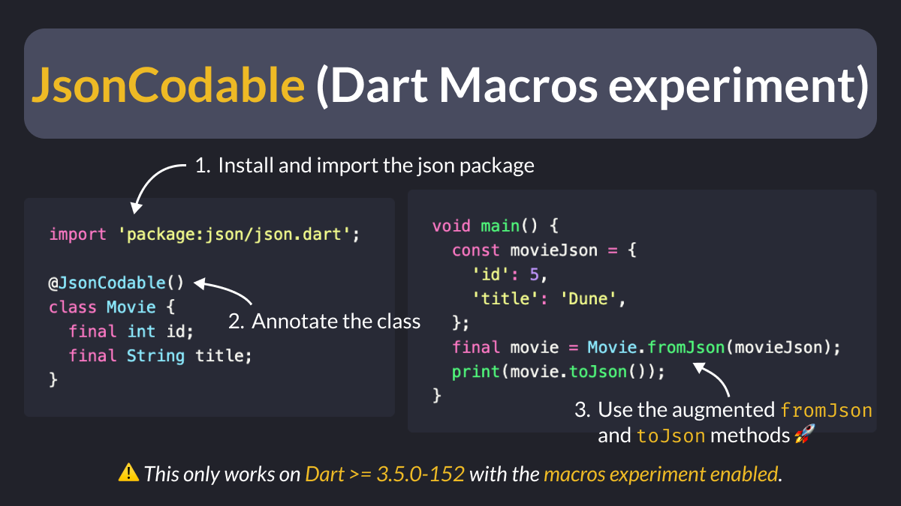

# JsonCodable (Dart Macros experiment)

Did you know?

As of Dart 3.5.0 (master channel), you can preview the experimental `JsonCodable` macro.

This macro **augments** your classes with `fromJson` and `toJson` methods, and it works in realtime as you edit your code (no code generation is needed).

<!--

// Example showing how to use the JsonCodable macro
import 'package:json/json.dart';

@JsonCodable()
class Movie {
  final int id;
  final String title;
}

void main() {
  const movieJson = {
    'id': 5,
    'title': 'Dune',
  };
  final movie = Movie.fromJson(movieJson);
  print(movie.toJson());
}

-->

---

As of May 2024, JsonCodable is not configurable and has two big limitations:

- field names must exactly match the keys in the maps
- default values are not supported

If you want to have a play with it, read the official docs for how to enable it:

- [Macros (experimental)](https://dart.dev/language/macros)

---

| Previous | Next |
| -------- | ---- |
| [Useful Aliases for Flutter Development](../0159-useful-aliases-flutter-dev/index.md) |  |

<!-- TWITTER|https://twitter.com/biz84/status/1790764117579509824 -->
<!-- LINKEDIN|https://www.linkedin.com/posts/andreabizzotto_did-you-know-as-of-dart-350-master-channel-activity-7196530105374961667-1t6q -->

